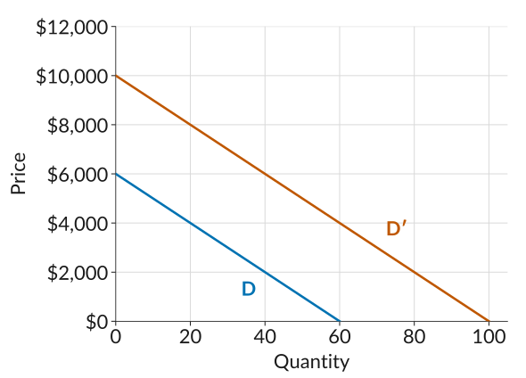
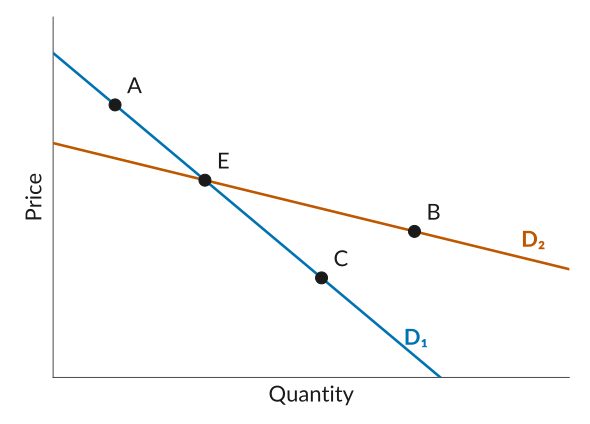

Work through each problem on paper before you open its **Solution**.

You can find the elasticity from percentage changes, or with the equivalent formula
$$\varepsilon = -\frac{P}{Q} \times \frac{\Delta Q}{\Delta P}$$

## 1. Nadia's kayak rentals

Nadia rents kayaks by the day at a lake. Her demand curve is
$$Q = 60 - 2P$$
where $Q$ is kayaks rented per day and $P$ is the price of a rental in dollars.

**(a)** How many kayaks does Nadia rent at a price of \$20? What is her revenue?

Solution

At \$20:
$$Q = 60 - 2 \times 20 = 20$$

Revenue is price times quantity:
$$R = P \times Q = 20 \times 20 = \$400$$

**(b)** Nadia raises her price from \$20 to \$21. How many kayaks does she rent now? Find the percentage change in price and in demand, and the price elasticity of demand.

Solution

At \$21:
$$Q = 60 - 2 \times 21 = 18$$

The percentage changes, starting from \$20 and 20 kayaks:
$$\%\text{ change in price} = \frac{100 \times 1}{20} = 5\%$$
$$\%\text{ change in demand} = \frac{100 \times (-2)}{20} = -10\%$$

The elasticity:
$$\varepsilon = -\frac{-10}{5} = 2$$

**Demand is elastic at \$20**, because 2 is greater than 1.

**(c)** Use $\varepsilon = -\dfrac{P}{Q} \times \dfrac{\Delta Q}{\Delta P}$ to find the elasticity at \$25 and at \$10. Where is demand elastic, and where is it inelastic?

Solution

Every \$1 rise in price costs Nadia 2 kayaks, so $\dfrac{\Delta Q}{\Delta P} = -2$.

At \$25:
$$Q = 60 - 2 \times 25 = 10, \qquad \varepsilon = -\frac{25}{10} \times (-2) = 5$$

At \$10:
$$Q = 60 - 2 \times 10 = 40, \qquad \varepsilon = -\frac{10}{40} \times (-2) = 0.5$$

**Demand is elastic at \$25 and inelastic at \$10.** The same formula at \$20 gives $-\tfrac{20}{20} \times (-2) = 2$, matching part (b).

## 2. Should Nadia raise her price?

Elasticity tells a firm whether a price rise will bring in more revenue or less. Use Nadia's demand curve from Problem 1.

**(a)** Nadia charges \$10 and rents 40 kayaks. She raises her price to \$15. How many kayaks does she rent now, and what happens to her revenue?

Solution

At \$15:
$$Q = 60 - 2 \times 15 = 30$$

Revenue before and after:
$$R = 10 \times 40 = \$400 \qquad\to\qquad R = 15 \times 30 = \$450$$

**Revenue rises by \$50**, even though she rents 10 fewer kayaks.

**(b)** Instead, Nadia charges \$20 and rents 20 kayaks. She raises her price to \$25. What happens to her revenue?

Solution

At \$25:
$$Q = 60 - 2 \times 25 = 10$$

Revenue before and after:
$$R = 20 \times 20 = \$400 \qquad\to\qquad R = 25 \times 10 = \$250$$

**Revenue falls by \$150.**

**(c)** Use the elasticity to explain why the same kind of price rise raises revenue in part (a) but lowers it in part (b).

Solution

A higher price means more revenue on each kayak still rented, but fewer kayaks rented. Which effect wins depends on the elasticity.

- **In part (a) demand is inelastic** ($\varepsilon = 0.5$ at \$10). The price rises by $100 \times 5 / 10 = 50\%$ and rentals fall by only $100 \times 10 / 40 = 25\%$, so revenue rises.
- **In part (b) demand is elastic** ($\varepsilon = 2$ at \$20). The price rises by $100 \times 5 / 20 = 25\%$ and rentals fall by $100 \times 10 / 20 = 50\%$, so revenue falls.

When demand is inelastic, quantity falls by a smaller percentage than the price rises, so a price rise brings in more revenue. When demand is elastic, it brings in less.

## 3. Competition and elasticity

**(a)** One café sits on a street with five other cafés. Another is the only place to buy coffee inside a large library. Which café is likely to face the more elastic demand? Which one can raise its price without losing many sales?

Solution

**The street café faces the more elastic demand.** If it raises its price, its customers can walk next door, so many of them may buy elsewhere. Competition from similar products limits its ability to raise its price.

**The library café can raise its price without losing many sales.** Its customers have no alternative nearby, so its demand is less elastic.

**(b)** True or false: a steep demand curve always has a lower elasticity than a flat one. Explain using Nadia's demand curve.

Solution

**False.** The elasticity depends on the slope and also on where you are on the curve, through $P/Q$. Nadia's demand curve has the same slope everywhere, yet its elasticity is 5 at \$25 and 0.5 at \$10. A steeper curve corresponds to a lower elasticity when two curves are compared at the same price and quantity, but slope and elasticity are not the same thing.

**(c)** The price of each item below goes up by 10%. In each pair, which one has the more elastic demand? Explain in a sentence.

- Sneakers, or one brand's running shoe.
- Electricity for your apartment, or a streaming subscription.

Solution

- **One brand's running shoe.** Its buyers have close alternatives in the other brands, so many of them switch. Buyers of sneakers in general have nowhere else to go.
- **A streaming subscription.** Its buyers can switch to another service or cancel and do without it. Electricity has no close alternative, and it is hard to do without.

**(d)** Nadia starts quoting her prices in cents, so her demand curve becomes $Q = 60 - 0.02P$, with $P$ in cents. What happens to $\Delta Q / \Delta P$? What is the elasticity at a price of 2,000 cents?

Solution

A \$1 rise is now a rise of 100 cents, and it still costs 2 kayaks, so $\Delta Q / \Delta P$ goes from $-2$ to $-0.02$: **100 times smaller.**

At 2,000 cents, $Q = 60 - 0.02 \times 2{,}000 = 20$, so
$$\varepsilon = -\frac{2{,}000}{20} \times (-0.02) = 2$$

**The elasticity is still 2**, the same as at \$20 in Problem 1. The price is 100 times larger and $\Delta Q / \Delta P$ is 100 times smaller, so they cancel. A 1% change in price is a 1% change whether we count in dollars or in cents, so the elasticity does not depend on the units.

## 4. Multiple choice

::: {.mcq answer="b,c"}

**1.** The diagram shows two alternative demand curves, D and D′, for a product. Select all the statements that are correct.

{width="480" fig-alt="Two parallel downward-sloping straight lines, price on the vertical axis from 0 to 12,000 dollars and quantity on the horizontal axis from 0 to 100. The lower line, D, runs from 6,000 dollars at zero quantity to zero price at 60 units. The upper line, D prime, runs from 10,000 dollars at zero quantity to zero price at 100 units."}

  a. On demand curve D, when the price is \$5,000, the firm can sell 15 units of the product.
  b. On demand curve D′, the firm can sell 70 units at a price of \$3,000.
  c. At a price of \$1,000, the firm can sell 40 more units of the product on D′ than on D.
  d. With an output of 30 units, the firm can charge \$2,000 more on D′ than on D.

Solution

On D, at \$5,000 the firm can sell 10 units, not 15. On D′, a price of \$3,000 corresponds to 70 units. D′ is D shifted right by 40 units, so at any price the firm can sell 40 more units on D′. At 30 units the price is \$3,000 on D and \$7,000 on D′, a difference of \$4,000, not \$2,000. **(b) and (c)** are correct.

:::

::: {.mcq answer="a,b,d"}

**2.** A shop sells 20 hats per week at \$10 each. When it increases the price to \$12, the number of hats sold falls to 15 per week. Select all the statements that are correct.

  a. When the price increases from \$10 to \$12, demand decreases by 25%.
  b. A 20% increase in the price causes a 25% fall in demand.
  c. The demand for hats is inelastic.
  d. Using these figures, we can estimate the elasticity of demand to be 1.25.

Solution

The price rises by $100 \times 2 / 10 = 20\%$ and demand falls by $100 \times 5 / 20 = 25\%$. The elasticity is $25 / 20 = 1.25$, which is greater than 1, so demand is elastic, not inelastic. **(a), (b), and (d)** are correct.

:::

::: {.mcq answer="a,d"}

**3.** The figure shows two demand curves, D₁ and D₂. Select all the statements that are correct.

{width="480" fig-alt="Two downward-sloping straight lines with no numbers on the axes, price on the vertical axis and quantity on the horizontal axis. D1 is steep and D2 is flatter, and they cross at point E. Point A is on D1 above and to the left of E. Point C is on D1 below and to the right of E. Point B is on D2 below and to the right of E, at a higher quantity and a higher price than C."}

  a. At E, demand curve D₁ is less elastic than D₂.
  b. The elasticity is the same at A and C.
  c. The firm with demand curve D₁ likely faces more competition than the firm with demand curve D₂.
  d. The elasticity is higher at E than at B.

Solution

At E the price and quantity are the same on both curves, but D₁ is steeper, so it is less elastic there. The slope is the same at A and C, but at A the price is higher and the quantity lower, so the elasticity is higher at A. D₁ is less elastic, so its firm likely faces less competition, not more. The slope is the same at E and B on D₂, but at E the price is higher and the quantity lower, so the elasticity is higher at E. **(a) and (d)** are correct.

:::

::: {.mcq answer="b"}

**4.** A firm raises its price by 4%, and the quantity it sells falls by 8%. The price elasticity of demand is:

  a. 0.5, so demand is inelastic.
  b. 2, so demand is elastic.
  c. $-2$, so demand is inelastic.
  d. 2, so demand is inelastic.

Solution

$\varepsilon = -\dfrac{-8}{4} = 2$. The minus sign in the formula makes the elasticity positive, and 2 is greater than 1, so demand is elastic. **(b)** is correct.

:::

::: {.mcq answer="a"}

**5.** A campus concert raises its ticket price from \$20 to \$25, and ticket sales fall from 400 to 320. The price elasticity of demand is:

  a. 0.8, so demand is inelastic.
  b. 1.25, so demand is elastic.
  c. 0.8, so demand is elastic.
  d. 16, so demand is elastic.

Solution

The price rises by $100 \times 5 / 20 = 25\%$ and sales fall by $100 \times 80 / 400 = 20\%$, so $\varepsilon = -\dfrac{-20}{25} = 0.8$. That is less than 1, so demand is inelastic. Option (b) divides the wrong way round, and (d) divides the change in tickets by the change in price instead of using percentages. **(a)** is correct.

:::
