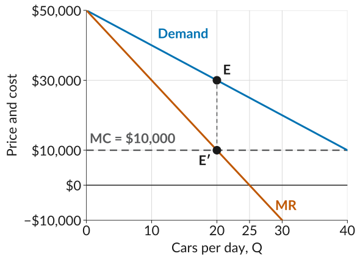

Work through each problem on paper before you open its **Solution**.

## 1. Sierra Bikes

Sierra Bikes assembles electric bikes. Its demand curve is
$$P = 1{,}200 - 10Q$$
where $Q$ is bikes per day and $P$ is the price in dollars, and its cost function is
$$C(Q) = 2{,}000 + 200Q$$

**(a)** Calculate Sierra's revenue, cost, and profit if it sells 20, 30, 40, 50, and 60 bikes a day.

Solution

To sell 20 bikes, the demand curve says the price has to be $P = 1{,}200 - 10 \times 20 = 1{,}000$. Revenue is $R = P \times Q = 1{,}000 \times 20 = 20{,}000$. Cost is $C(Q) = 2{,}000 + 200 \times 20 = 6{,}000$. So profit is $20{,}000 - 6{,}000 = 14{,}000$.

Doing the same for the other quantities:

::: {.freetable .table-scroll tabindex="0"}
| $Q$ | $P$   | $R$    | $C(Q)$ | Profit |
|:---:|:-----:|:------:|:------:|:------:|
| 20  | 1,000 | 20,000 | 6,000  | 14,000 |
| 30  | 900   | 27,000 | 8,000  | 19,000 |
| 40  | 800   | 32,000 | 10,000 | 22,000 |
| 50  | 700   | 35,000 | 12,000 | 23,000 |
| 60  | 600   | 36,000 | 14,000 | 22,000 |

: {tbl-colwidths="[16,21,21,21,21]"}
:::

**(b)** Which quantity gives the most profit, and what price does Sierra charge there?

Solution

Profit is highest at **50 bikes a day**, where the price is **\$700** and profit is **\$23,000 a day**.

Revenue is higher still at 60 bikes, \$36,000 against \$35,000, but the extra 10 bikes add \$2,000 to cost and only \$1,000 to revenue, so profit falls.

**(c)** Now zoom in around 50 bikes. To sell one more bike, Sierra has to lower its price by \$10. Find its revenue at 49, 50, and 51 bikes. How much do the 50th and the 51st bikes each add to revenue? Marginal cost is \$200 a bike. Is each of those bikes worth selling?

Solution

To sell 49 bikes, the price has to be $1{,}200 - 10 \times 49 = 710$, so revenue is $710 \times 49 = 34{,}790$. For 50 bikes it has to be \$700, so revenue is $700 \times 50 = 35{,}000$. For 51 bikes it has to be \$690, so revenue is $690 \times 51 = 35{,}190$.

The 50th bike adds $35{,}000 - 34{,}790 = 210$ to revenue, more than its \$200 cost, so **it is worth selling**. The 51st adds only $35{,}190 - 35{,}000 = 190$, less than it costs, so **it is not**. Sierra stops at 50 bikes, where marginal revenue drops below marginal cost, which matches part (b).

**(d)** Sierra's landlord raises the rent, so its fixed cost rises from \$2,000 to \$3,000 a day. Marginal cost is still \$200 a bike. Does the profit-maximizing quantity or price change? What is Sierra's profit now?

Solution

**Neither changes.** The rent is paid whatever Sierra sells, so it does not change what one more bike adds to revenue or to cost: the 50th bike still adds \$210 against a cost of \$200, and the 51st only \$190. Profit falls by \$1,000 at every quantity, so it still peaks at **50 bikes at \$700**, and profit there is now $23{,}000 - 1{,}000 = $ **\$22,000 a day**.

The rent does matter for a different decision: whether to operate at all. If Sierra could avoid the rent by closing, it compares what it earns from the bikes with the rent. At 50 bikes, revenue minus the cost of the bikes is $35{,}000 - 200 \times 50 = 25{,}000$, so Sierra stays open as long as the rent is below \$25,000 a day.

## 2. Marisol's cakes

Marisol bakes custom birthday cakes. From past orders she knows how many cakes she sells in a day at each price. Her cost function is
$$C(Q) = 30 + 20Q$$
a \$30 daily fee for a shared kitchen and \$20 of ingredients for each cake.

::: {.freetable .table-scroll tabindex="0"}
| Price, $P$ | Cakes sold, $Q$ |
|:----------:|:---------------:|
| \$55       | 1               |
| \$50       | 2               |
| \$45       | 3               |
| \$40       | 4               |
| \$35       | 5               |
| \$30       | 6               |

: {tbl-colwidths="[50,50]"}
:::

**(a)** Find her revenue, cost, and profit at each price. Which price gives the most profit?

Solution

Revenue is $P \times Q$, and cost is $30 + 20Q$.

::: {.freetable .table-scroll tabindex="0"}
| $P$ | $Q$ | $R$ | $C(Q)$ | Profit |
|:---:|:---:|:---:|:------:|:------:|
| 55  | 1   | 55  | 50     | 5      |
| 50  | 2   | 100 | 70     | 30     |
| 45  | 3   | 135 | 90     | 45     |
| 40  | 4   | 160 | 110    | 50     |
| 35  | 5   | 175 | 130    | 45     |
| 30  | 6   | 180 | 150    | 30     |

: {tbl-colwidths="[20,20,20,20,20]"}
:::

Profit is highest at **\$40 a cake**, where she sells **4 cakes** and makes **\$50 a day**.

**(b)** Each row of the table adds one cake, so the change in revenue from one row to the next is the marginal revenue of that cake. Find the marginal revenue of each cake. Her marginal cost is \$20 a cake. Which cakes are worth baking?

Solution

::: {.freetable .table-scroll tabindex="0"}
| Cake    | Revenue goes from | to  | $\text{MR}$ | $\text{MC}$ |
|:-------:|:-----------------:|:---:|:-----------:|:-----------:|
| 1st     | 0                 | 55  | 55          | 20          |
| 2nd     | 55                | 100 | 45          | 20          |
| 3rd     | 100               | 135 | 35          | 20          |
| 4th     | 135               | 160 | 25          | 20          |
| 5th     | 160               | 175 | 15          | 20          |
| 6th     | 175               | 180 | 5           | 20          |

: {tbl-colwidths="[16,24,16,22,22]"}
:::

The first four cakes each add more to revenue than the \$20 they cost, so **the first four are worth baking**. The 5th cake adds only \$15, less than its cost. So Marisol stops at 4 cakes, the same answer as part (a).

Notice that marginal revenue is below the price: to sell the 4th cake she cuts the price from \$45 to \$40, so the 4th cake brings in \$40 but the other 3 cakes each sell for \$5 less, and $40 - 15 = 25$.

## 3. Sorting

For each firm below, say whether it should sell more, sell less, or stay where it is.

  i. A firm with $\text{MR} = 40$ and $\text{MC} = 25$ at its current quantity.
  ii. A firm with $\text{MR} = 12$ and $\text{MC} = 30$ at its current quantity.
  iii. A firm with $\text{MR} = 18$ and $\text{MC} = 18$ at its current quantity.

Solution

- **(i) Sell more.** Each extra unit brings in \$40 and costs \$25, so it adds \$15 to profit.
- **(ii) Sell less.** Each unit at the margin brings in \$12 but costs \$30, so cutting back raises profit.
- **(iii) Stay.** Marginal revenue equals marginal cost, so profit is already as high as it goes.

## 4. Multiple choice

::: {.mcq answer="a,b,d"}

**1.** A smoothie stand's demand curve is $P = 10 - Q/20$, where $Q$ is smoothies sold per day. Select all the statements that are correct.

  a. To sell 100 smoothies a day, the highest price the stand can charge is \$5.
  b. If the stand sets a price of \$6, it sells 80 smoothies a day.
  c. The stand could sell 120 smoothies a day at a price of \$6.
  d. Choosing how many smoothies to sell and choosing the price are the same decision.

Solution

The demand curve ties price and quantity together. To sell 100 smoothies the price has to be $10 - 100/20 = 5$, and at \$6 buyers take $20 \times (10 - 6) = 80$, not 120. So once the stand picks a quantity, the demand curve fixes the price, and the other way round. **(a), (b), and (d)** are correct.

:::

::: {.mcq answer="b"}

**2.** *(Adapted from CORE Question 7.9)* Beautiful Cars has the cost function $C(Q) = 60{,}000 + 10{,}000Q$. It maximizes its profit by producing $Q^* = 20$ cars and setting the price at $P^* = \$30{,}000$, for a profit of \$340,000. Suppose that the firm chooses instead to produce $Q = 20$ cars and sets the price at $P = \$29{,}800$. Which statement is correct?

  a. The profit remains the same at \$340,000.
  b. The profit is reduced to \$336,000.
  c. The average cost of production is \$17,000.
  d. The firm is unable to sell all the cars.

Solution

Since $Q$ is still 20, production costs remain the same, but revenue falls by \$200 on each car, or \$4,000 in total, so profit is \$340,000 − \$4,000 = \$336,000. Average cost is $260{,}000 / 20 = \$13{,}000$; \$17,000 is the profit per car, \$340,000 / 20. At the lower price more than 20 buyers want a car, so the firm has no problem selling all 20. **(b)** is correct.

:::

::: {.mcq answer="a"}

**3.** *(Adapted from CORE Question 7.10)* Beautiful Cars maximizes its profit at $P^* = \$30{,}000$ and $Q^* = 20$, and its marginal cost is \$10,000 for every car. Suppose that the firm decides to switch to a higher price. Which statement is correct?

  a. The firm reduces the quantity of cars produced.
  b. The marginal cost of producing an extra car is higher.
  c. The total cost of production is higher.
  d. The profit increases due to the new higher price.

Solution

At a price above \$30,000 the firm can sell fewer than 20 cars, and it will not produce more cars than it can sell. Marginal cost is \$10,000 for every car, so it does not rise, and producing fewer cars lowers total cost. Profit falls, because 20 cars at \$30,000 was already the profit-maximizing choice. **(a)** is correct.

:::

::: {.mcq answer="a,c"}

**4.** *(Adapted from CORE Question 7.11)* The figure shows marginal cost, demand, and marginal revenue for Beautiful Cars. Select all the statements that are correct.

{width="600" fig-alt="Three lines, price and cost on the vertical axis with marks at minus 10,000, 0, 10,000, 30,000, and 50,000 dollars, and cars per day on the horizontal axis with marks at 0, 10, 20, 25, 30, and 40. The demand curve falls from 50,000 dollars at zero cars. The marginal revenue line starts at the same point, falls twice as steeply, passes 30,000 dollars at 10 cars, crosses zero at 25 cars, and reaches minus 10,000 dollars at 30 cars. Marginal cost is a flat dashed line at 10,000 dollars. Marginal revenue crosses marginal cost at 20 cars, at the point labelled E prime, directly below the point E on the demand curve at 30,000 dollars."}

  a. At 10 cars, marginal revenue is above marginal cost, so selling one more car raises profit.
  b. At 30 cars, marginal revenue is negative, so the firm's total profit must be negative.
  c. The firm maximizes profit at 20 cars, where marginal revenue equals marginal cost, and charges \$30,000.
  d. The firm should produce 25 cars, where marginal revenue is zero.

Solution

At 10 cars marginal revenue is \$30,000 and marginal cost is \$10,000, so one more car adds to profit. At 30 cars the extra car loses money, but the firm still makes a profit on the cars before it: profit at 30 cars is \$240,000, so it is not negative. Marginal revenue equals marginal cost at 20 cars, and the demand curve above that point gives the price, \$30,000. At 25 cars marginal revenue is zero, which is where revenue is highest, but every car past the 20th adds less to revenue than its \$10,000 cost, so profit is lower there. **(a) and (c)** are correct.

:::

::: {.mcq answer="c"}

**5.** A firm's marginal cost is \$4 at every quantity. The marginal revenue from one more unit is \$8 at 10 units, \$6 at 20, \$4 at 30, and \$2 at 40, falling steadily in between. Which quantity maximizes its profit?

  a. 10
  b. 20
  c. 30
  d. 40

Solution

Up to 30 units, each extra unit adds more to revenue than the \$4 it costs, so profit rises. Past 30, marginal revenue is below \$4 and each extra unit lowers profit. Profit is highest where marginal revenue equals marginal cost, at 30 units. **(c)** is correct.

:::

::: {.mcq answer="b"}

**6.** A firm sells 30 units at \$600 each. To sell a 31st unit it has to lower its price to \$590. What is its marginal revenue from the 31st unit?

  a. \$10
  b. \$290
  c. \$590
  d. \$600

Solution

Revenue rises from $30 \times 600 = 18{,}000$ to $31 \times 590 = 18{,}290$, so marginal revenue is \$290. Put another way, the 31st unit brings in \$590, but the other 30 units each sell for \$10 less, a loss of \$300. **(b)** is correct.

:::

::: {.mcq answer="a"}

**7.** At its current quantity a firm has marginal revenue of \$200 and marginal cost of \$100. What should it do?

  a. Sell more, because the next unit adds more to revenue than to cost.
  b. Sell less, because marginal revenue is falling.
  c. Stay where it is, because profit is already highest.
  d. Raise the price and sell the same quantity.

Solution

While marginal revenue is above marginal cost, each extra unit adds to profit, so the firm expands until the two are equal. It cannot raise the price and hold quantity, because the demand curve ties the two together. **(a)** is correct.

:::

::: {.mcq answer="c,d"}

**8.** A firm's fixed cost rises by \$500 a day, and nothing else changes. Select all the statements that are correct.

  a. Its profit-maximizing quantity falls.
  b. Its marginal cost rises by \$500.
  c. Its profit at every quantity falls by \$500.
  d. It charges the same price as before.

Solution

The fixed cost is paid whatever the firm produces, so it does not change what one more unit adds to cost: marginal cost stays the same. Profit at every quantity falls by the same \$500, so the quantity with the highest profit, and the price that sells it, do not change. **(c) and (d)** are correct.

:::
