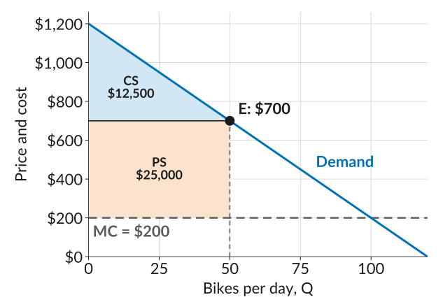
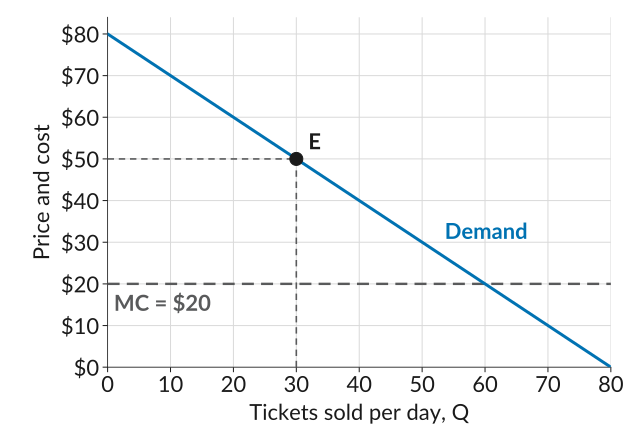

::: {.practice-links}
[Lecture 10 slides](../slides/lecture10.html) · [Worksheet 10 (PDF)](../worksheets/worksheet10.pdf) · [Module III: Firms as Price Setters](../content/firms-as-price-setters.qmd)
:::

Work through each problem on paper before you open its **Solution**.

## 1. Sierra Bikes

Sierra Bikes assembles electric bikes. Its demand curve is $P = 1{,}200 - 10Q$, where $Q$ is bikes per day and $P$ is the price in dollars, and its cost function is $C(Q) = 2{,}000 + 200Q$. Sierra maximizes its profit by selling 50 bikes a day at \$700 each.

**(a)** How much is the 10th buyer willing to pay? What is the joint surplus from selling this buyer a bike, and how much of it goes to the buyer and how much to Sierra?

Solution

The 10th buyer's willingness to pay is the height of the demand curve at 10 bikes: $\text{WTP} = 1{,}200 - 10 \times 10 = 1{,}100$. Each bike costs Sierra \$200 to make, so the joint surplus is $\text{WTP} - \text{MC} = 1{,}100 - 200 = 900$.

At a price of \$700, the buyer gets $\text{WTP} - P = 1{,}100 - 700 = $ **\$400**, and Sierra gets $P - \text{MC} = 700 - 200 = $ **\$500**. Together they add up to the joint surplus of **\$900**.

**(b)** Draw Sierra's demand curve and marginal cost. Mark the point where it sells 50 bikes at \$700, and shade consumer surplus and producer surplus. Find each, and Sierra's profit.

Solution

{width="600" fig-alt="Sierra Bikes' demand curve, a straight line falling from 1,200 dollars at zero bikes to zero at 120 bikes, with marginal cost flat at 200 dollars and the point E at 50 bikes and 700 dollars. The triangle between the demand curve and the price line at 700 dollars, from zero to 50 bikes, is shaded light blue and labelled consumer surplus, 12,500 dollars. The rectangle between the price line and marginal cost at 200 dollars, from zero to 50 bikes, is shaded light orange and labelled producer surplus, 25,000 dollars."}

Consumer surplus is the triangle between the demand curve and the price. The demand curve starts at \$1,200, so
$$\text{CS} = \tfrac{1}{2} \times 50 \times (1{,}200 - 700) = 12{,}500$$

Producer surplus is the rectangle between the price and marginal cost:
$$\text{PS} = (700 - 200) \times 50 = 25{,}000$$

Profit is producer surplus minus the fixed cost: $25{,}000 - 2{,}000 = $ **\$23,000 a day**.

## 2. Escape Hour

Escape Hour is the only escape room in town. The figure shows its demand curve and its marginal cost: each extra player costs \$20 in staff time and supplies. Escape Hour maximizes its profit at the point $E$, selling 30 tickets a day at \$50 each.

{width="600" fig-alt="Escape Hour's demand curve, a straight line falling from 80 dollars at zero tickets to zero at 80 tickets, with price and cost on the vertical axis marked every 10 dollars from 0 to 80, and tickets sold per day on the horizontal axis marked every 10 from 0 to 80. Marginal cost is a flat dashed line at 20 dollars. The point E is on the demand curve at 30 tickets and 50 dollars, with dashed guides to both axes."}

**(a)** Find consumer surplus and producer surplus.

Solution

Consumer surplus is the triangle between the demand curve (which starts at \$80) and the price:
$$\text{CS} = \tfrac{1}{2} \times 30 \times (80 - 50) = 450$$

Producer surplus is the rectangle between the price and marginal cost:
$$\text{PS} = (50 - 20) \times 30 = 900$$

**(b)** Who captures more of the surplus, the players or Escape Hour? Why?

Solution

**Escape Hour**, with \$900 of the \$1,350. It is the only escape room in town, so it has market power: it can set a high price, and players who value the game highly will still pay it. One player cannot bargain for a better deal, because Escape Hour has many other customers.

**(c)** Suppose Escape Hour lowered its price to \$40. How many tickets would it sell? What would happen to consumer surplus and producer surplus?

Solution

At \$40, the demand curve shows **40 tickets** sold.

$$\text{CS} = \tfrac{1}{2} \times 40 \times (80 - 40) = 800 \qquad \text{PS} = (40 - 20) \times 40 = 800$$

Consumer surplus **rises from \$450 to \$800**, and producer surplus **falls from \$900 to \$800**. The lower price moves surplus from Escape Hour to the players who were already buying, and the 10 extra players add surplus of their own.

## 3. Multiple choice

::: {.mcq answer="b"}

**Q1.** A demand curve is $P = 90 - 2Q$. How much is the 15th buyer willing to pay?

  a. \$15
  b. \$60
  c. \$75
  d. \$90

Solution

A buyer's willingness to pay is the height of the demand curve at their place in line: $90 - 2 \times 15 = 60$. **(b)** is correct.

:::

::: {.mcq answer="b"}

**Q2.** A buyer is willing to pay \$120 for a jacket. The store's marginal cost is \$50, and the price is \$80. How much surplus does the buyer get from the sale?

  a. \$30
  b. \$40
  c. \$70
  d. \$120

Solution

The buyer gets $\text{WTP} - P = 120 - 80 = 40$. The store gets $P - \text{MC} = 80 - 50 = 30$, and the joint surplus is $120 - 50 = 70$. **(b)** is correct.

:::

::: {.mcq answer="a,b,c"}

**Q3.** A firm's demand curve is $P = 60 - Q$ and its marginal cost is \$20 at every quantity. It sells 20 units at \$40, and its fixed cost is \$150. Select all the statements that are correct.

  a. Consumer surplus is \$200.
  b. Producer surplus is \$400.
  c. Profit is \$250.
  d. Consumer surplus equals the price times the quantity sold.

Solution

Consumer surplus is the triangle $\tfrac{1}{2} \times 20 \times (60 - 40) = 200$, and producer surplus is the rectangle $(40 - 20) \times 20 = 400$. Profit is producer surplus minus the fixed cost, $400 - 150 = 250$. Price times quantity is revenue, not consumer surplus. **(a), (b), and (c)** are correct.

:::

::: {.mcq answer="c"}

**Q4.** A firm's producer surplus is \$5,000 a day, and its fixed cost is \$1,500 a day. What is its profit?

  a. \$1,500
  b. \$5,000
  c. \$3,500
  d. \$6,500

Solution

Producer surplus does not count the fixed cost, so profit is $5{,}000 - 1{,}500 = 3{,}500$. **(c)** is correct.

:::

::: {.mcq answer="a,b,d"}

**Q5.** A buyer is willing to pay \$1,100 for a bike that costs Sierra \$200 to make. Sierra cuts the price from \$700 to \$650. Select all the statements that are correct.

  a. The joint surplus from the sale stays at \$900.
  b. The buyer's gain rises from \$400 to \$450.
  c. Sierra's gain rises by \$50.
  d. The price cut moves \$50 of surplus from Sierra to the buyer.

Solution

The joint surplus is $\text{WTP} - \text{MC} = 1{,}100 - 200 = 900$, whatever the price. At \$700 the buyer gets \$400 and Sierra \$500; at \$650 the buyer gets \$450 and Sierra \$450. The price only moves surplus from one side to the other, so Sierra's gain falls. **(a), (b), and (d)** are correct.

:::

::: {.mcq answer="a"}

**Q6.** Which firm is most likely to capture a large share of the surplus from its sales?

  a. The only ferry company serving an island.
  b. One of many identical food trucks parked on the same street.
  c. A gas station next to three other gas stations.
  d. A seller on a website where hundreds of others sell the same phone case.

Solution

The split of the surplus depends on bargaining power. The only ferry to an island can set a high price, and passengers who value the trip highly will still pay it. The other sellers each face many close competitors, so a high price would send their customers elsewhere. **(a)** is correct.

:::
