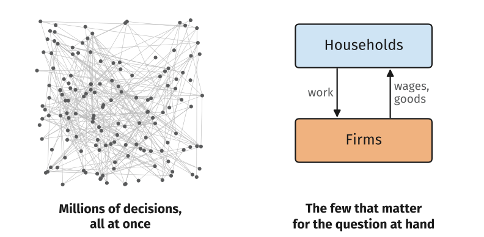
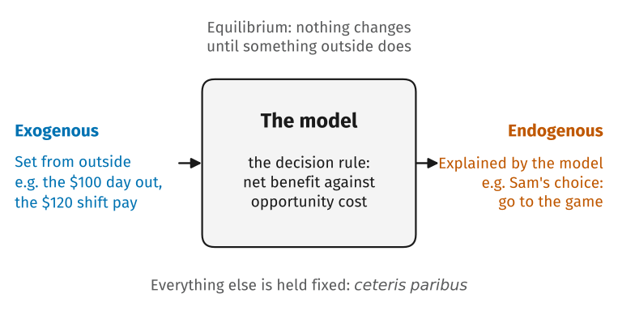

<!--
Parked from lecture 3 (2026-08-31) when CORE 2.8 came out of its reading:
the what-is-a-model arc, held for the lecture where equilibrium first does
real work (the market lectures, Unit 8). The leading underscore keeps this
file out of every render. Figures it uses, looking-at-less.svg and
model-box.svg, are drawn by slides/figures/make_lecture3.py; model-box is
labelled with Sam's Saturday decision from lecture 3, so relabel it there
when this content lands in its new home.
-->

## From One Decision to a Whole Economy

::: {.plain}
We just modelled one person and one Saturday. The economy is millions of these decisions, all interacting at once.
:::

{fig-alt="Two panels. On the left, about 150 dots joined by a tangle of criss-crossing lines, captioned millions of decisions all at once; it is a sketch of complexity, not data. On the right, two boxes, households above and firms below, joined by one arrow down labelled work and one arrow up labelled wages and goods, captioned the few that matter for the question at hand."}

## Seeing More by Looking at Less

- We cannot describe every decision, so we build *models*: deliberately simple descriptions that keep only what matters for the question being asked.
- A subway map is wrong about distance, direction, and scale, and it is exactly what you want when you are trying to change trains.
- A good economic model leaves out almost everything, on purpose. The skill is knowing what to leave out, and that depends on the question.

## The Parts of a Model

{fig-alt="A rounded box labelled the model, described inside as the decision rule: net benefit against opportunity cost. An arrow enters from the left from exogenous variables, set from outside the model, for example the $100 day out and the $120 shift pay. An arrow leaves to the right to endogenous variables, explained by the model, for example Sam's choice to go to the game. Above the box: equilibrium, nothing changes until something outside does. Below it: everything else is held fixed, ceteris paribus."}

## The Vocabulary

- *Exogenous*: set from outside the model. The modeller picks its value.
- *Endogenous*: generated by the model. Its value is whatever the model's workings produce.
- *Ceteris paribus*: "other things equal". Change one thing, hold the rest fixed, and see what follows.
- *Equilibrium*: a situation that keeps itself going. Nothing changes until something outside the model changes.

## What Makes a Model Good

::: {.incremental}
- *Clear*: it helps us understand something that matters.
- *Predicts accurately*: its predictions line up with the evidence.
- *Improves communication*: it makes precise what we agree and disagree about.
- *Useful*: we can use it to find ways to improve how the economy works.
:::

::: {.fragment}
::: {.takeaway}
A model is never "true", only useful or not. Bad models produce bad policy, which is why every model in this course gets checked against evidence.
:::
:::

## Your Turn

::: {.plain}
Take Sam's Saturday decision, the game or the shift, and treat it as a model.
:::

::: {.incremental}
- Which variables are *exogenous*?
- Which are *endogenous*?
- What is being held fixed by *ceteris paribus*?
- What would count as evidence *against* this model of how people choose?
:::
