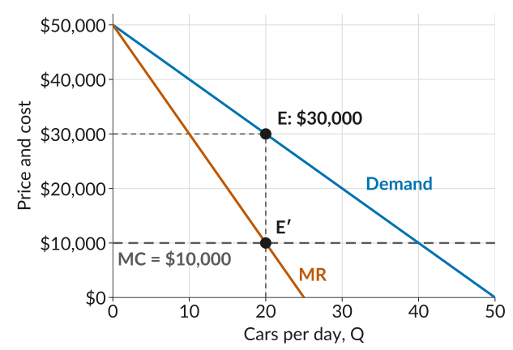
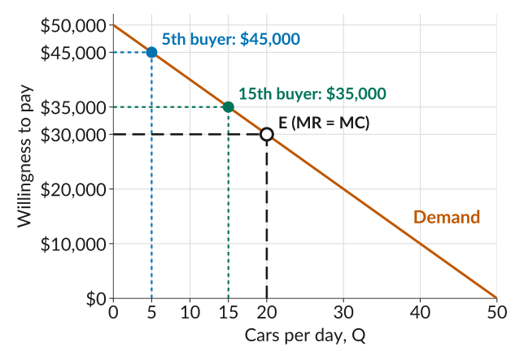
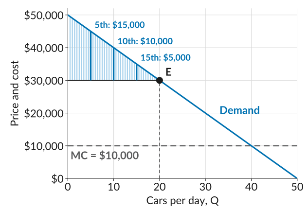
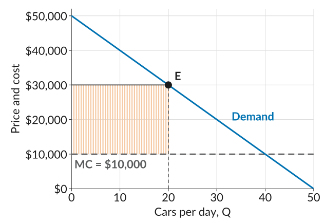

## Last Class: Choosing Price and Quantity

-   *Marginal revenue* (MR) is the increase in revenue when one more unit is sold. To sell it, the firm lowers the price on every unit, so MR is below the price.
-   *Marginal cost* (MC) is the increase in cost when one more unit is produced.
-   While MR is above MC, one more unit adds to profit. Once MR falls below MC, it lowers profit. So the firm produces where $\text{MR} = \text{MC}$.
-   The demand curve then gives the price it can charge for that quantity.

::: plain
*Today*: when something is bought and sold, how much does everyone gain from the sale?
:::

## Beautiful Cars

:::::: columns
:::: {.column width="38%"}
-   Each car costs Beautiful Cars \$10,000 to make.
-   MR equals MC at 20 cars, at $E'$.
-   At 20 cars, the demand curve gives a price of \$30,000, at $E$.

::: plain
Who gains from these sales, and by how much?
:::
::::

::: {.column width="62%"}
{fig-alt="Three lines, price and cost on the vertical axis from 0 to 50,000 dollars and cars per day on the horizontal axis from 0 to 50. The demand curve falls from 50,000 dollars at zero cars to zero at 50 cars. The marginal revenue line starts at the same point and falls twice as steeply, reaching zero at 25 cars. Marginal cost is a flat dashed line at 10,000 dollars. Marginal revenue crosses marginal cost at 20 cars, marked E prime, directly below the point E on the demand curve at 30,000 dollars. Dotted guides run from E across to 30,000 dollars on the vertical axis and down through E prime to 20 cars on the horizontal axis."}
:::
::::::

## Demand as Willingness to Pay

:::::: columns
:::: {.column width="38%"}
-   The height of the demand curve at $Q$ is the willingness to pay (WTP) of the $Q$th buyer.
-   Consider the 5th buyer. What is the total gain from the car sold to this buyer at a price of \$30,000?
::::

::: {.column width="62%"}
{fig-alt="The demand curve for Beautiful Cars as a straight line, willingness to pay on the vertical axis from 0 to 50,000 dollars and cars per day on the horizontal axis from 0 to 50. Three points on the curve, each with dotted guides to both axes: at 5 cars, labelled 5th buyer, 45,000 dollars, in blue; at 15 cars, labelled 15th buyer, 35,000 dollars, in green; and at 20 cars, the point E, labelled E (MR = MC), an open circle with heavier dashed guides to 30,000 dollars and 20 cars."}
:::
::::::

## The Surplus on One Car

::: eqgroup
The 5th buyer's willingness to pay for a car is \$45,000. What is the *buyer's gain* from the sale?

$$\text{Buyer's gain} = \text{WTP} - P = 45{,}000 - 30{,}000 = 15{,}000$$
:::

::: eqgroup
What is the *firm's gain* from the sale? It is the profit on this one car:

$$\text{Firm's gain} = P - \text{MC} = 30{,}000 - 10{,}000 = 20{,}000$$
:::

::: eqgroup
The *joint surplus* (a measure of the gains from trade) is the sum of the economic rents of all involved in an economic interaction:

$$\text{Joint surplus} = \underbrace{(\text{WTP} - P)}_{\text{buyer's gain}} + \underbrace{(P - \text{MC})}_{\text{firm's gain}} = \text{WTP} - \text{MC} = 35{,}000$$
:::

## The Surplus on Two Cars

::: plain
Doing the same for the 15th buyer, whose willingness to pay is \$35,000:
:::

::: {.fixedtable .wide}
| Buyer | WTP    | Joint surplus, $\text{WTP} - \text{MC}$ | Buyer's gain, $\text{WTP} - P$ | Firm's gain, $P - \text{MC}$ |
|:-----:|:------:|:---------------------------------------:|:------------------------------:|:----------------------------:|
| 5th   | 45,000 | 35,000                   | 15,000                          | 20,000                        |
| 15th  | 35,000 | 25,000                   | 5,000                           | 20,000                        |

: {tbl-colwidths="[12,16,22,26,24]"}
:::

-   Every buyer pays the same price, so the firm's gain is \$20,000 on every car.
-   The buyer's gain shrinks as willingness to pay falls.

::: plain
What is the total gain in the market, adding up the gains of all the buyers and the firm's gains on all the cars it sells?
:::

## Consumer Surplus

:::::: columns
:::: {.column width="38%" .tighteq}
-   Each consumer's surplus from a sale is $\text{WTP} - P$.
-   *Consumer surplus (CS)*: the sum of these surpluses across all consumers.
-   Calculate using the area of a triangle:

    $$\begin{aligned} \text{CS} &= \tfrac{1}{2} \times \text{base} \times \text{height} \\ &= \tfrac{1}{2} \times 20 \times 20{,}000 \\ &= 200{,}000 \end{aligned}$$
::::

::: {.column width="62%"}
{fig-alt="Demand falling from 50,000 dollars at zero cars to zero at 50 cars, marginal cost as a flat dashed line at 10,000 dollars, and a horizontal price line at 30,000 dollars from zero to 20 cars, ending at the point E on the demand curve. The triangle between the price line and the demand curve is filled with thin light blue vertical lines, one for every half car, each running from the price up to the demand curve. Three are drawn darker and labelled with the buyer's gain: the 5th buyer, 15,000 dollars; the 10th, 10,000 dollars; the 15th, 5,000 dollars."}
:::
::::::

## Producer Surplus

:::::: columns
:::: {.column width="38%" .tighteq}
-   The firm's surplus from each sale is $P - \text{MC}$.
-   *Producer surplus (PS)*: the sum of these surpluses across all units sold.
-   Calculate using the area of a rectangle:

    $$\begin{aligned} \text{PS} &= \text{base} \times \text{height} \\ &= 20 \times 20{,}000 \\ &= 400{,}000 \end{aligned}$$
::::

::: {.column width="62%"}
{fig-alt="The same demand curve, marginal cost line at 10,000 dollars, and price line at 30,000 dollars from zero to 20 cars ending at E. The rectangle between marginal cost and the price, from zero to 20 cars, is filled with thin light orange vertical lines, one for every half car, each running from 10,000 up to 30,000 dollars."}
:::
::::::

## Producer Surplus and Profit

::: plain
Producer surplus is not the same as profit. The difference is the fixed cost.
:::

::: eqgroup
Recall that Beautiful Cars' cost function is $C(Q) = 60{,}000 + 10{,}000Q$, with a fixed cost of \$60,000 a day. Its profit from 20 cars at \$30,000 is

$$\text{Profit} = \underbrace{30{,}000 \times 20}_{\textstyle\style{font-size:90%}{\text{Revenue}}} - \underbrace{(60{,}000 + 10{,}000 \times 20)}_{\textstyle\style{font-size:90%}{\text{Cost}}} = 340{,}000$$
:::

::: eqgroup
The producer surplus was \$400,000, so

$$\text{Profit} = \text{Producer surplus} - \text{Fixed cost} = 400{,}000 - 60{,}000 = 340{,}000$$
:::

::: plain
Producer surplus compares selling cars with selling none. Even if Beautiful Cars sold no cars today, it would still pay \$60,000 for its factory, so that cost is not part of what its sales add.
:::

## Who Captures the Surplus?

::: eqgroup
The joint surplus from a sale does not depend on the price:

$$\text{Joint surplus} = \text{WTP} - \text{MC}$$
:::

-   The price $P$ decides the split: the buyer gets $\text{WTP} - P$ and the firm gets $P - \text{MC}$.
-   The split depends on *bargaining power*: each side's ability to push the price in its favor.
-   Beautiful Cars is the only seller of its car, so it has *market power*: it can set a high price, and buyers who value the car highly will still pay it.
-   One buyer cannot bargain for a better deal, because the firm has many other customers. The firm takes \$400,000 of the \$600,000.
