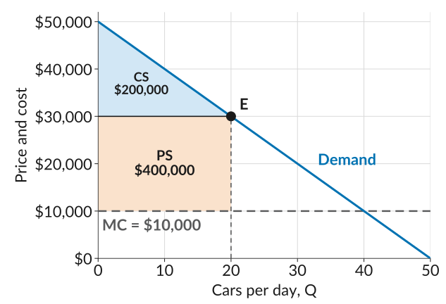
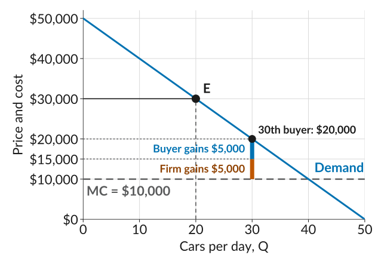
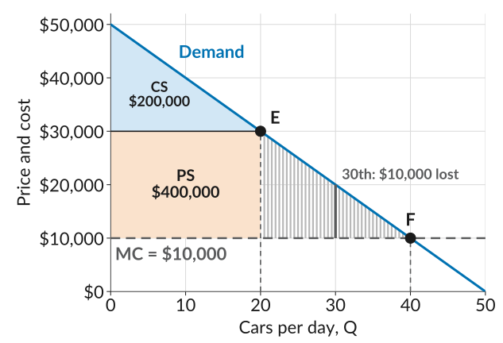
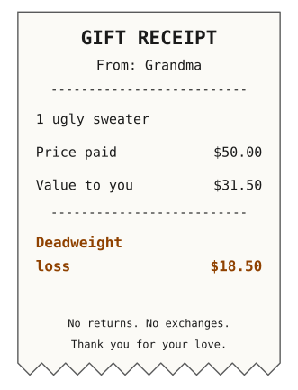

## Last Class: Surplus in the Market for Beautiful Cars

:::::: columns
:::: {.column width="38%"}
-   The 20 sales create \$600,000 of surplus a day: \$200,000 for buyers and \$400,000 for the firm.
-   How do we judge if this is a good market outcome?
-   One criterion economists use is *Pareto efficiency*.
::::

::: {.column width="62%"}
{fig-alt="Demand falling from 50,000 dollars at zero cars to zero at 50 cars, marginal cost as a flat dashed line at 10,000 dollars, and a horizontal price line at 30,000 dollars from zero to 20 cars, ending at the point E on the demand curve. The triangle between the price line and the demand curve is shaded light blue and labelled consumer surplus, 200,000 dollars. The rectangle between marginal cost and the price, from zero to 20 cars, is shaded light orange and labelled producer surplus, 400,000 dollars."}
:::
::::::

## Pareto Efficiency

-   An outcome is *Pareto efficient* if there is no other (feasible) outcome in which at least one person would be better off, and nobody worse off.
-   We say there is a possible *Pareto improvement* if some change would make at least one person better off without making anyone worse off.
-   Example: say you order pizza with your friends, and one friend eats all of it. Is that Pareto efficient?

::: plain
In the market for Beautiful Cars, could there be a Pareto improvement? There could be if there are buyers who value a car at more than the \$10,000 it costs to make, but do not get one.
:::
## Buyers Left Out

:::::: columns
:::: {.column width="38%"}
-   The 30th buyer's WTP is \$20,000, above the \$10,000 MC.
-   At \$30,000, this buyer does not buy.
-   Sell this buyer one car at \$15,000: each side gains \$5,000.
-   Nobody is worse off, so this is a Pareto improvement.
::::

::: {.column width="62%"}
{fig-alt="Demand falling from 50,000 dollars at zero cars to zero at 50 cars, marginal cost as a flat dashed line at 10,000 dollars, and a price line at 30,000 dollars out to the point E at 20 cars. The point for the 30th buyer is on the demand curve at 30 cars and 20,000 dollars, below the price. A thick bar at 30 cars runs from marginal cost up to 20,000 dollars, split at 15,000 dollars: the lower part, in orange, is labelled firm gains 5,000 dollars, and the upper part, in blue, is labelled buyer gains 5,000 dollars. Dotted guides mark 15,000 and 20,000 dollars on the vertical axis."}
:::
::::::

## Why Does Beautiful Cars Stop at 20?

::: plain
In fact, buyers 21 to 40 all value a car above its \$10,000 MC but do not get one, so the outcome at $E$ is not Pareto efficient. What is stopping Beautiful Cars from selling to them?
:::

-   It sets a single price for all buyers. Selling to each buyer at a different price is hard to arrange, and it is hard to know each buyer's willingness to pay.
-   To reach the 30th buyer, it would have to charge \$20,000 to all 30 buyers, which would lower its profit.
-   Setting different prices for different buyers, based on their willingness to pay, is called *price discrimination*. Where do we see this around us?

::: plain
Can we measure the surplus lost from these missing sales?
:::

## Deadweight Loss

:::::: columns
:::: {.column width="38%" .tighteq}
-   Buyers 21 to 40 value a car above its MC but do not get one, so each loses $\text{WTP} - \text{MC}$.
-   *Deadweight loss (DWL)*: the total surplus lost.
-   Calculate using the area of a triangle:

    $$\begin{aligned} \text{DWL} &= \tfrac{1}{2} \times 20 \times 20{,}000 \\ &= 200{,}000 \end{aligned}$$
::::

::: {.column width="62%"}
{fig-alt="The same figure with a third shaded area. Consumer surplus of 200,000 dollars and producer surplus of 400,000 dollars sit to the left of 20 cars. A triangle from the point E, at 20 cars and 30,000 dollars, down to marginal cost at 20 cars and across to the point F, where demand meets marginal cost at 40 cars and 10,000 dollars, is filled with thin grey vertical lines, one for every half car, each running from marginal cost up to the demand curve. This is the deadweight loss. The line at 30 cars, from 10,000 up to 20,000 dollars, is drawn darker and labelled 30th, 10,000 dollars lost."}
:::
::::::

## The Deadweight Loss of Christmas

:::::: columns
:::: {.column width="62%"}
-   Economist Joel Waldfogel calculated the deadweight loss of Christmas.
-   He asked college students what each gift cost, and what they would have paid for it.
-   Gifts were worth 10% to a third less than they cost: a \$4 to \$13 billion deadweight loss in the US in 1992.
-   A dollar from friends was worth about 99 cents; from grandparents, about 63 cents (though grandparents seem to know it: 43% of their gifts were cash).
::::

::: {.column width="38%"}
{fig-alt="A joke gift receipt from Grandma for one ugly sweater. Price paid: 50 dollars. Value to you: 31 dollars and 50 cents. Deadweight loss: 18 dollars and 50 cents. At the bottom: No returns. No exchanges. Thank you for your love."}
:::
::::::

::: dim
Source: Waldfogel (1993), [American Economic Review]{.book} 83(5).
:::

## What to Do Next

-   Before next class: read section *7.7*, and go over the *slides* and the *worksheet*.
-   Section 7.7 also asks what happens if the firm could charge every buyer their full willingness to pay (Exercise 7.3). We skip that exercise for now.
-   Work through the *practice problems* for this lecture.
-   Next week we look at market power: how firms stand out from the crowd, and why some markets end up with a single firm.
-   *Quiz 5 is Monday, October 5*, and covers Lectures 10 and 11.
