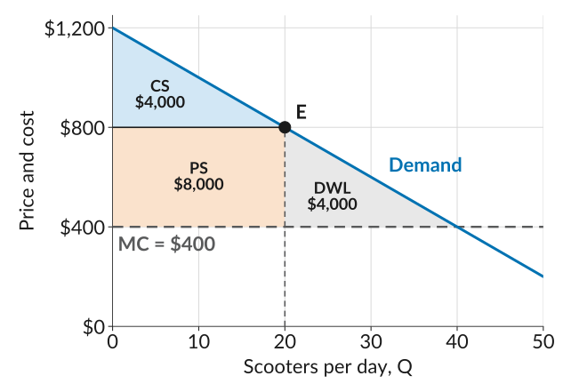
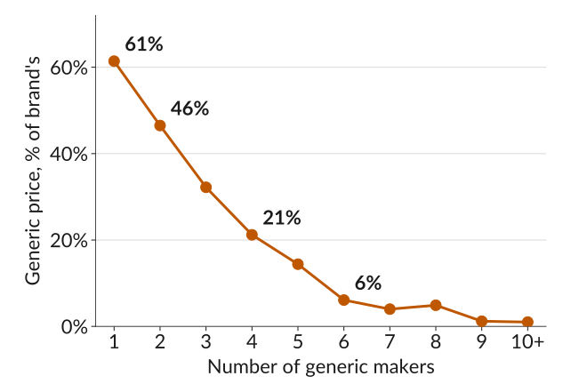
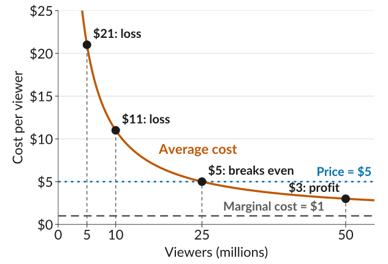
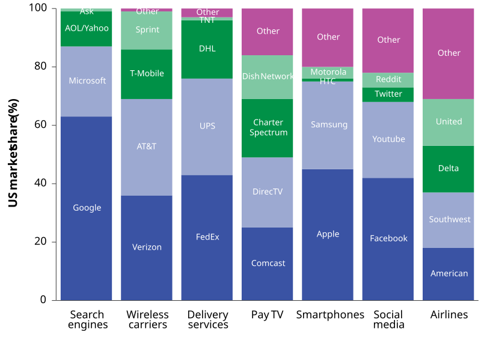
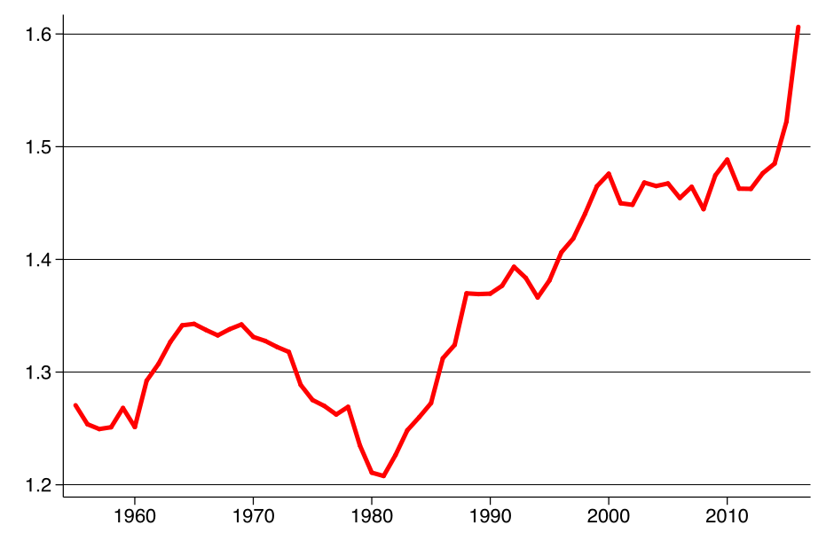

## Electric Scooters

:::::: columns
:::: {.column width="46%" .tighteq}
-   The company sells 20 scooters a day at \$800, at $E$. Each one costs \$400 to make.
-   The three areas:

    $$\begin{aligned} \text{CS} &= \tfrac{1}{2} \times 20 \times 400 = 4{,}000 \\ \text{PS} &= 400 \times 20 = 8{,}000 \\ \text{DWL} &= \tfrac{1}{2} \times 20 \times 400 = 4{,}000 \end{aligned}$$
::::

::: {.column width="54%"}
{fig-alt="The scooter company's demand curve, a straight line falling from 1,200 dollars at zero scooters to 200 dollars at 50 scooters, with price and cost on the vertical axis and scooters per day on the horizontal axis. Marginal cost is a flat dashed line at 400 dollars. The point E is on the demand curve at 20 scooters and 800 dollars. Three shaded areas: the triangle above the 800 dollar price line and below demand, labelled CS, 4,000 dollars; the rectangle between 400 and 800 dollars from zero to 20 scooters, labelled PS, 8,000 dollars; and the triangle from E down to marginal cost and out to where demand meets marginal cost at 40 scooters, labelled DWL, 4,000 dollars."}
:::
::::::

::: plain
Why can this company charge more than marginal cost, and how much more?
:::

## Market Power

-   The scooter company sells a product that is at least a little different from what other firms sell.
-   Some buyers prefer its scooters, so they do not all switch to another brand when it charges a little more.
-   If every buyer switched to the cheapest scooter, a rival could charge a little less, and this company would sell nothing at \$800.
-   We say a firm has *market power* if it can set its price above marginal cost without losing all its buyers to rivals.
-   A firm whose product has few close *substitutes* has market power.

## Price Markup

::: plain
The *profit margin* is the price minus marginal cost, $P - \text{MC}$. The *price markup* is the profit margin as a share of the price:
:::

::: {.eqmid .eqbelow}
$$\text{markup} = \frac{P - \text{MC}}{P}$$
:::

::: plain
*Example*: the scooter company maximizes profit by producing where $\text{MR} = \text{MC}$, at 20 scooters, and setting $P = 800$. Its $\text{MC}$ is 400.
:::

-   Its profit margin is $800 - 400 = 400$ on each scooter.
-   Its markup is $400 / 800 = 1/2$, or 50% of the price.

## The Markup Rule

::: plain
When a firm maximizes profit, its markup equals one over the price elasticity of demand at its chosen point:
:::

::: eqmid
$$\frac{P - \text{MC}}{P} = \frac{1}{\varepsilon}$$
:::

-   *Example*: at $E$, the scooter demand curve has slope $-20$, so:

    ::: eqmid
    $$\varepsilon = -\frac{P}{Q} \times \frac{1}{\text{slope}} = \frac{800}{20} \times \frac{1}{20} = 2$$
    :::

    -   Then $1/\varepsilon = 1/2$, the same as its markup.
-   The *less elastic* its demand, the *higher the markup* a firm sets.
-   Fewer close substitutes make demand less elastic, so a firm with more market power sets a higher markup.

## Markups in the Data

::: plain
Estimates for US cars, with prices in 1983 dollars (Berry, Levinsohn, and Pakes, 1995):
:::

::: {.fixedtable .wide}
| Car           |     Price | $P - \text{MC}$ | Markup | Elasticity |
|:--------------|----------:|----------------:|-------:|-----------:|
| Mazda 323     |  \$5,049  |          \$801  |   16%  |        6.3 |
| Nissan Sentra |  \$5,661  |          \$880  |   16%  |        6.4 |
| Lexus LS400   | \$27,544  |        \$9,030  |   33%  |        3.1 |
| BMW 735i      | \$37,490  |       \$10,975  |   29%  |        3.4 |

: {tbl-colwidths="[28,18,20,16,18]"}
:::

-   Small cars have many close substitutes, so their demand is elastic and their markups are low.
-   Luxury cars have fewer substitutes, so their markups are about twice as high.

## Generic Drugs

:::::: columns
:::: {.column width="46%"}
-   When a patent runs out, other firms can sell the same drug.
-   FDA data: with one generic maker, the price is 61% of the brand's. With six, it is 6%.
-   More sellers of the same drug means more elastic demand and lower prices.
::::

::: {.column width="54%"}
{fig-alt="Median generic drug price as a percentage of the brand's price before generic entry, by number of generic makers from 1 to 10 or more. The line falls steeply and then flattens: 61% with one maker, 46% with two, 32% with three, 21% with four, 14% with five, 6% with six, then 4%, 5%, 1%, and 1% with seven, eight, nine, and ten or more makers. The values at one, two, four, and six makers are labelled."}
:::
::::::

## Where Does Market Power Come From?

::: plain
A firm has market power when its buyers do not switch easily to rivals, so its demand is less elastic. We look at two sources of market power:
:::

1.  *Product differentiation*: the firm sells something different from its rivals, so buyers have fewer close substitutes.
2.  *Cost advantages of size*: when producing more makes each unit cheaper, a few big firms can serve the whole market, and small rivals cannot keep up.

## Source 1: Product Differentiation

::: plain
How do firms make their products different?
:::

1.  *Location and service*: shops differ by location, selection, and extras.
2.  *Innovation*: the Toyota Prius, the first mass-produced hybrid (1997), had few close rivals for about 15 years.
3.  *Advertising*: it informs buyers, draws them from rivals, and builds brand loyalty.
    -   US cereal makers spend 5.5% of their revenue on ads.
    -   Ads raised a cereal brand's demand more than price cuts did (Shum, 2004).

## Source 2: Cost Advantages of Size

:::::: columns
:::: {.column width="48%"}
-   A movie costs \$100 million to make and \$1 per extra stream, so AC falls as more people watch.
-   At a \$5 price, a studio *breaks even* with 25 million viewers, and loses money with fewer.
-   Two studios splitting 50 million viewers just break even. Three all lose. Only a few large firms survive.
::::

::: {.column width="52%"}
{fig-alt="A film's average cost per viewer on the vertical axis from 0 to 25 dollars, and viewers in millions on the horizontal axis. The average cost curve falls steeply and then flattens. A dotted horizontal line marks the 5 dollar price. The curve crosses it at 25 million viewers, labelled 5 dollars, breaks even. To the left the curve is above the price: 21 dollars at 5 million viewers and 11 dollars at 10 million, both labelled loss. To the right it is below: 3 dollars at 50 million viewers, labelled profit. Marginal cost is a dashed line at 1 dollar."}
:::
::::::

## Natural Monopoly

-   A *monopoly* is a firm that is the only seller of a product with no close substitutes.
-   When a single firm can supply the whole market at a lower AC than two firms could, the market is a *natural monopoly*: water, electricity, and gas networks, whose pipes and wires are a huge fixed cost.
-   With strongly falling AC, competition can be winner-takes-all. The more searches Google ran, the more data it gathered, and the cheaper it became to serve each user.

## Markets With Few Firms

{width="100%" fig-alt="Stacked bars of US market shares in seven markets, each bar adding to 100%. Search engines: Google about 63%, Microsoft about 24%, AOL and Yahoo about 12%, Ask about 1%. Wireless carriers: Verizon about 36%, AT&T about 33%, T-Mobile about 17%, Sprint about 13%. Delivery services: FedEx about 43%, UPS about 33%, DHL about 20%, TNT and others the rest. Pay TV: Comcast about 25%, DirecTV about 24%, Charter Spectrum about 20%, Dish Network about 15%, others about 16%. Smartphones: Apple about 45%, Samsung about 30%, Motorola and HTC about 5%, others about 20%. Social media: Facebook about 42%, YouTube about 26%, Twitter and Reddit about 10%, others about 22%. Airlines: American about 18%, Southwest about 19%, Delta about 16%, United about 16%, others about 31%."}

## Market Structures

::: plain
Economists group markets by how many firms sell, how different their products are, and how easily new firms can enter:
:::

::: {.fixedtable .wide .gridtable}
| Structure                | Firms | Products        | Entry   | Control over price | Example           |
|:-------------------------|:-----:|:---------------:|:-------:|:------------------:|:-----------------:|
| Perfect competition      | Many  | Identical       | Easy    | None               | Wheat farms       |
| Monopolistic competition | Many  | Differentiated  | Easy    | Some               | Restaurants       |
| Oligopoly                | Few   | Either          | Hard    | Some, rivals react | Wireless carriers |
| Monopoly                 | One   | No substitutes  | Blocked | Most               | Water utility     |

: {tbl-colwidths="[26,8,18,10,20,18]"}
:::

## Markups Over Time

:::::: columns
:::: {.column width="46%"}
-   The figure shows the average $P/\text{MC}$ of US public firms (De Loecker, Eeckhout, and Unger, 2020).
-   Prices went from 21% above MC in 1980 to 61% in 2016.
-   In our measure, $(P - \text{MC})/P$, that is 17% to 38%.
::::

::: {.column width="54%"}
{fig-alt="A line chart of the average ratio of price to marginal cost for US publicly traded firms, 1955 to 2016, on a vertical scale from 1.2 to 1.6. The ratio is about 1.27 in 1955, rises to about 1.34 in the mid-1960s, falls to its low of about 1.21 around 1980, then climbs fairly steadily to about 1.47 by 2000, stays near 1.45 to 1.49 through the 2000s, and jumps to about 1.61 in 2016."}
:::
::::::

::: plain
A price above MC means a deadweight loss. Should the government do something about rising market power?
:::

## Competition Policy

::: plain
*Competition policy* (or *antitrust policy*) is government policy and law that limits market power, prevents cartels, and regulates how firms compete.
:::

-   Authorities investigate when one or a few dominant firms are limiting their rivals, so buyers get less from competition than they could.
-   They step in only when a firm has both the ability and the incentive to abuse its market power.
-   Firms limit competition in two ways: by keeping rivals out, and by making their own demand less elastic.

## Keeping Rivals Out

-   From expanding: UK supermarkets bought land near their stores and left it empty, so rivals could not build there.
-   From inputs: Ferrero, the maker of Nutella, bought one of its hazelnut suppliers. Regulators allowed it, since enough other suppliers remained.
-   From ideas: a *patent* gives a firm the sole right to an idea for a time, as a reward for research. When it expires, rivals enter: generic drugs.
-   From buyers: Microsoft kept rival web browsers off Windows, so they could not reach its users. After years of investigation and fines, a browser market developed.

## Mergers, Cartels, and Loyalty

-   Merging with rivals: Meta bought Instagram and WhatsApp. Authorities weigh the harm against the savings from scale and network effects, and have sometimes let such mergers through.
-   Colluding: a *cartel* is a group of firms that agree to act like one monopoly. Cartels are illegal in most countries, but hard to prove.
-   Making buyers less price-sensitive: advertising that builds a brand, paying for shelf space or the top spot in a search, and products that work best together, like Apple's.

## Case by Case

-   Authorities weigh the harms and the benefits of each case on its own.
-   For a natural monopoly, the answer is usually close regulation of its prices, or public ownership.
-   Platforms are a dilemma: scale and network effects make them look like natural monopolies, yet many sellers and advertisers compete on them. The debate continues.
-   Competition keeps moving, and policy often plays catch-up: Chrome now dominates the browser market that the Microsoft case opened up.

## What to Do Next

-   Before next class: read sections *7.8*, *7.9*, *7.11*, and *7.12*, the markup rule in *7.6*, and the *notes on market structures*. Go over the *slides*.
-   We skip CORE's derivation of the markup rule from isoprofit curves, and its discussion of digital platforms.
-   Work through the *practice problems* for this lecture.
-   Next class: with only a few firms, each firm's best price depends on what its rivals charge. We model this as a game.

## Sources {.smaller}

-   Berry, Levinsohn, and Pakes (1995), "Automobile Prices in Market Equilibrium," Econometrica 63(4), as reported in CORE Figure 7.22.
-   Schonfeld and Associates estimate of US cereal advertising, as reported in CORE section 7.9.
-   Conrad and Lutter (2019), "Generic Competition and Drug Prices: New Evidence Linking Greater Generic Competition and Lower Generic Drug Prices," US Food and Drug Administration, using average manufacturer prices.
-   De Loecker, Eeckhout, and Unger (2020), "The Rise of Market Power and the Macroeconomic Implications," Quarterly Journal of Economics 135(2), Figure I.
-   Shambaugh, Nunn, Breitwieser, and Liu (2018), "The State of Competition and Dynamism," Hamilton Project, Brookings Institution; figure from CORE, The Economy 2.0: Microeconomics, Figure 7.26 (CC BY-NC-ND 4.0).
-   Shum (2004), "Does Advertising Overcome Brand Loyalty? Evidence from the Breakfast-Cereals Market," Journal of Economics & Management Strategy 13(2), 241 to 272.
