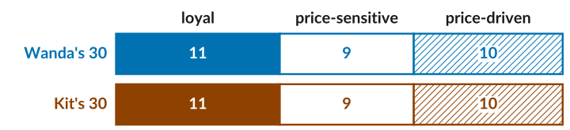
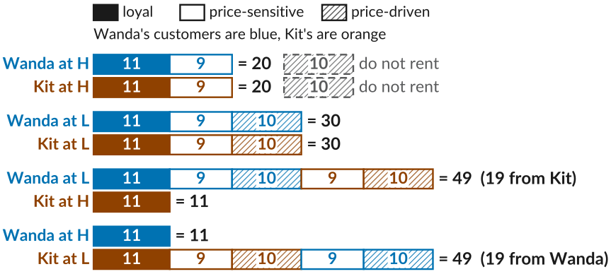
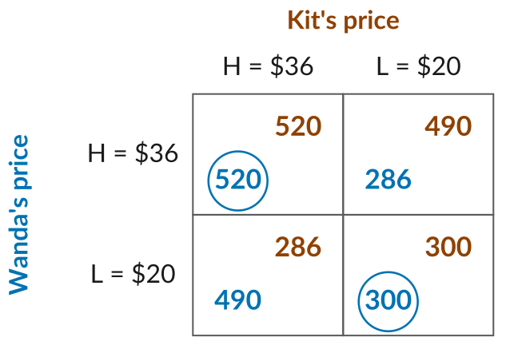
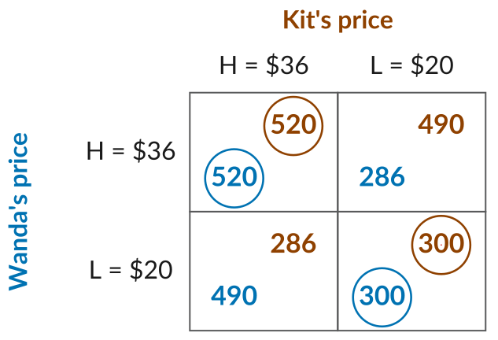
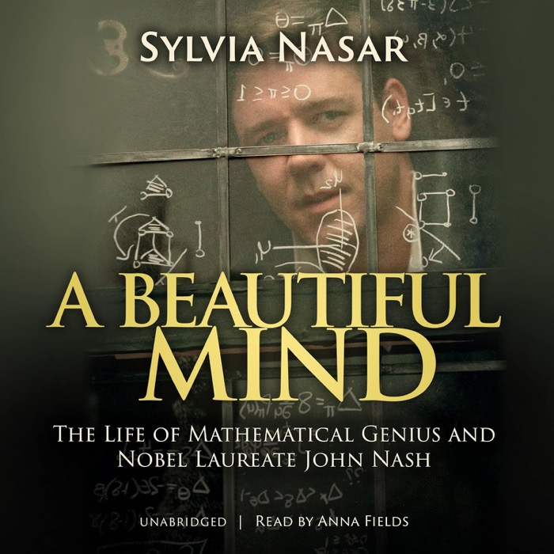
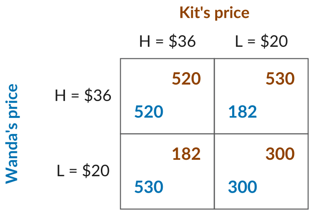
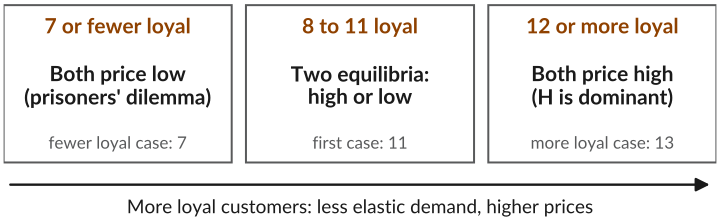

## Last Class: Market Structures

-   So far, a firm set its price taking its demand curve as given. It assumed its own price would have little effect on what competitors do.
-   That is reasonable with many substitutes, each reaching a small part of the market, e.g., a city's many clothing shops.
-   With only a few firms, one firm's price changes the demand the others face. E.g., three fast food places in a mall each know their prices affect the others.
-   Pricing decisions are then interdependent, so each firm has to think strategically about what its rivals will do.

::: plain
*Today*: how do firms set prices when each one has to think about what the others will do?
:::

## Wanda and Kit

-   On a Southern California beach, Wanda rents windsurf boards and Kit rents kiteboards.
-   Each rental costs its owner \$10, so $\text{MC} = 10$. Each picks a high price, $H = \$36$, or a low price, $L = \$20$, without knowing the other's.
-   Each has 30 customers who prefer its sport. *Loyal* customers rent from it at any price, *price-sensitive* ones pay $H$ but switch if the rival is cheaper, and *price-driven* ones pay $L$ but not $H$.

{.nostretch width="85%" fig-alt="Two bars of 30 customers each. Wanda's 30, in blue: 11 loyal (solid), 9 price-sensitive (open), and 10 price-driven (hatched). Kit's 30, in orange, are split the same way."}

## Who Rents at Each Pair of Prices

{.nostretch width="100%" fig-alt="A key at the top: solid is loyal, open is price-sensitive, hatched is price-driven; blue are Wanda's customers and orange are Kit's. Then, for each pair of prices, two bars showing who rents from Wanda and from Kit. Both H: Wanda has her 11 loyal and 9 price-sensitive customers, 20 in all, and Kit the same; each firm's 10 price-driven customers do not rent. Both L: each has all 30 of its own customers. Wanda L, Kit H: Wanda has her own 30 plus Kit's 9 price-sensitive and 10 price-driven, 49 in all, labelled 19 from Kit, and Kit keeps only his 11 loyal. Wanda H, Kit L: the mirror image, Wanda 11 and Kit 49."}

::: plain
The rival's price-sensitive and price-driven customers go to whichever firm is cheaper. *Try it*: [interactive version](https://www.dbhagia.com/econ201/interactive/wanda-kit.html).
:::

## Game Theory

::: plain
We can study this interaction using *game theory*, a set of models of strategic interactions.
:::

-   A *strategic interaction* is one where each person's outcome depends on what others do, and each person knows it.
-   A *game* describes the players, what they can do (their *strategies*), and what each one gets (their *pay-offs*).
-   Here, the players are Wanda and Kit, the strategies are $H$ and $L$, and the pay-offs are their profits.
-   It is a *simultaneous game*: each chooses without knowing what the other has chosen. They play only once.

## The Pay-off Matrix

:::::: columns
:::: {.column width="46%"}
-   Profit is $(P - 10) \times \text{customers}$.
-   Both at $H$: $(36 - 10) \times 20 = 520$ each.
-   Wanda at $L$, Kit at $H$: Wanda earns $(20 - 10) \times 49 = 490$, and Kit $(36 - 10) \times 11 = 286$.
-   In each cell, Wanda's profit is at the bottom left and Kit's at the top right.
::::

::: {.column width="54%"}
{fig-alt="A two-by-two pay-off matrix. Rows are Wanda's price, H equals 36 dollars or L equals 20 dollars; columns are Kit's price, the same two options. In each cell Wanda's profit is at the bottom left and Kit's at the top right. Both H: Wanda 520, Kit 520. Wanda H, Kit L: Wanda 286, Kit 490. Wanda L, Kit H: Wanda 490, Kit 286. Both L: Wanda 300, Kit 300."}
:::
::::::

## Best Response

:::::: columns
:::: {.column width="46%"}
-   A *best response* is the strategy that gives a player the highest pay-off, given what the others choose.
-   If Kit picks $H$: Wanda earns 520 at $H$ and 490 at $L$, so she picks $H$.
-   If Kit picks $L$: 286 at $H$ and 300 at $L$, so she picks $L$.
-   Blue rings mark her best responses. She matches Kit's price.
::::

::: {.column width="54%"}
{fig-alt="The pay-off matrix, with a blue ring around Wanda's profit in two cells: 520 when both choose H, and 300 when both choose L. Both H: Wanda 520, Kit 520. Wanda H, Kit L: Wanda 286, Kit 490. Wanda L, Kit H: Wanda 490, Kit 286. Both L: Wanda 300, Kit 300."}
:::
::::::

## Nash Equilibrium

:::::: columns
:::: {.column width="46%"}
-   A *Nash equilibrium*: each player's strategy is a best response to the others'.
-   Orange rings mark Kit's best responses. $(H, H)$ and $(L, L)$ have both rings, so both are Nash equilibria.
-   It is our prediction: neither firm wants to change on its own.
-   Both prefer $(H, H)$, but $H$ is riskier. Which happens depends on what each expects.
::::

::: {.column width="54%"}
{fig-alt="The same pay-off matrix with Wanda's best responses ringed in blue and Kit's ringed in orange. Both H: a ring around Wanda's 520 and a ring around Kit's 520. Both L: a ring around Wanda's 300 and a ring around Kit's 300. The two other cells, with 286 and 490, are unmarked. Each of the two cells where both choose the same price has both players ringed."}
:::
::::::

## John Nash

:::::: columns
::: {.column width="36%"}
{fig-alt="Cover of the book A Beautiful Mind by Sylvia Nasar, subtitled The Life of Mathematical Genius and Nobel Laureate John Nash. A still from the film shows a man looking out through a window pane covered in handwritten equations and diagrams."}
:::

:::: {.column width="64%"}
-   John Nash finished his 27-page doctoral thesis at Princeton at 21.
-   It defined the Nash equilibrium, which transformed economics and won him a share of the 1994 Nobel Prize.
-   His life is the subject of the book and film [A Beautiful Mind]{.book}.
::::
::::::

## More Loyal Customers

:::::: columns
:::: {.column width="46%"}
-   Now each firm has 13 loyal and 7 price-sensitive customers.
-   If Kit picks $L$, Wanda earns $26 \times 13 = 338$ at $H$, more than 300 at $L$.
-   So $H$ is her best response whatever Kit does: a *dominant strategy*. Same for Kit.
-   More loyal customers: less elastic demand, and both charge high.
::::

::: {.column width="54%"}
{fig-alt="The pay-off matrix when each firm has 13 loyal and 7 price-sensitive customers. Both H: Wanda 520 and Kit 520, both ringed. Wanda H, Kit L: Wanda 338 ringed, Kit 470. Wanda L, Kit H: Wanda 470, Kit 338 ringed. Both L: Wanda 300, Kit 300, unmarked. Wanda's rings are both in the H row and Kit's both in the H column, so the only cell with both rings is H, H."}
:::
::::::

## Fewer Loyal Customers

:::::: columns
:::: {.column width="46%"}
-   Now each firm has only 7 loyal and 13 price-sensitive customers.
-   At $(H, L)$, the high-priced firm keeps just its 7 loyal customers: $26 \times 7 = 182$. The other gets 53: $10 \times 53 = 530$.
-   What is each firm's best response? Where does the game end up?
::::

::: {.column width="54%"}
{fig-alt="The pay-off matrix when each firm has 7 loyal and 13 price-sensitive customers, with no marks. Both H: 520 each. Wanda H and Kit L: Wanda 182, Kit 530. Wanda L and Kit H: Wanda 530, Kit 182. Both L: 300 each."}
:::
::::::

## Prisoners' Dilemma

:::::: columns
:::: {.column width="46%"}
-   $L$ is dominant for both: 530 beats 520, and 300 beats 182.
-   The only Nash equilibrium is $(L, L)$, at 300 each, though both would earn 520 at $(H, H)$.
-   A *prisoners' dilemma*: each player has a dominant strategy, but another outcome gives every player more.
-   Self-interest drives the price down, and customers gain.
::::

::: {.column width="54%"}
{fig-alt="The pay-off matrix when each firm has 7 loyal and 13 price-sensitive customers. Both H: Wanda 520, Kit 520, unmarked. Wanda H, Kit L: Wanda 182, Kit 530 ringed. Wanda L, Kit H: Wanda 530 ringed, Kit 182. Both L: Wanda 300 ringed, Kit 300 ringed. Wanda's rings are both in the L row and Kit's both in the L column, so the only cell with both rings is L, L."}
:::
::::::

## Loyalty and Prices

{.nostretch width="100%" fig-alt="Three boxes in a row, over an arrow pointing right labelled more loyal customers: less elastic demand, higher prices. First box, 7 or fewer loyal customers per firm: both price low, a prisoners' dilemma; this is the fewer loyal case, 7. Second box, 8 to 11 loyal: two equilibria, high or low; this is the first case, 11. Third box, 12 or more loyal: both price high, H is dominant; this is the more loyal case, 13."}

-   More loyal customers means the two boards are more differentiated, so demand is less elastic and prices are higher.
-   Fewer loyal customers means buyers compare prices, so competition is more intense and prices are lower.

::: plain
*Try it*: change the loyal customers in the [interactive version](https://www.dbhagia.com/econ201/interactive/wanda-kit.html).
:::

## What Wanda and Kit Tell Us

::: plain
With only a few firms, each firm's best price depends on what its rivals charge. Two things follow:
:::

1.  *Differentiation still sets prices.* As with the markup rule, the more loyal the customers, the less elastic demand is and the higher the prices. When customers compare prices, competition pushes prices down.
2.  *Self-interest can work against the firms and for the buyers.* Both would earn more charging high, but each gains by undercutting, so both end up low. Customers benefit, which is why few rivals are tempted to collude, and why cartels are illegal.

::: plain
In our game they choose once. Firms that meet every day may each hold back from cutting for fear the other will match: one way few rivals keep prices high without ever agreeing to.
:::

## Midterm 1

-   *Monday, October 12*, in class, 65 minutes. It covers Lectures 3 to 13.
-   The exam has three parts, weighted equally: multiple-choice questions, short-answer problems, and one long-form question. Each part is its own sheet, so write your name and CWID on every sheet.
-   The exam is worth 15% of your course grade. Closed book and closed notes.
-   Bring a basic calculator. You will be given the help sheet.
-   To prepare, follow the *study guide*. Then take the *practice exam* timed, with only the help sheet, and check it with the solutions.
