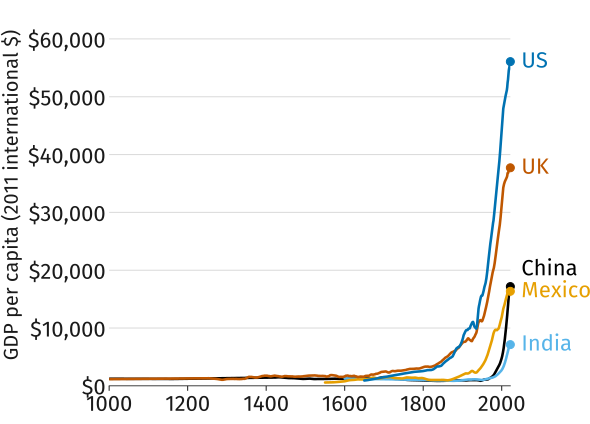
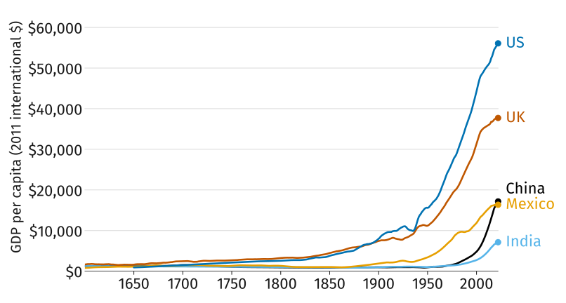
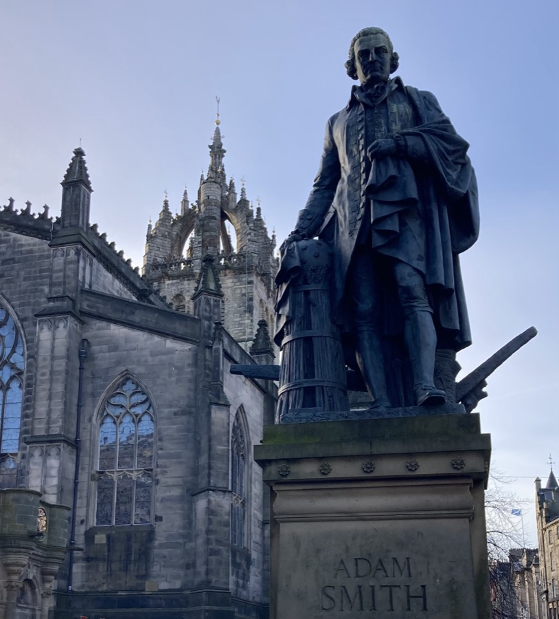
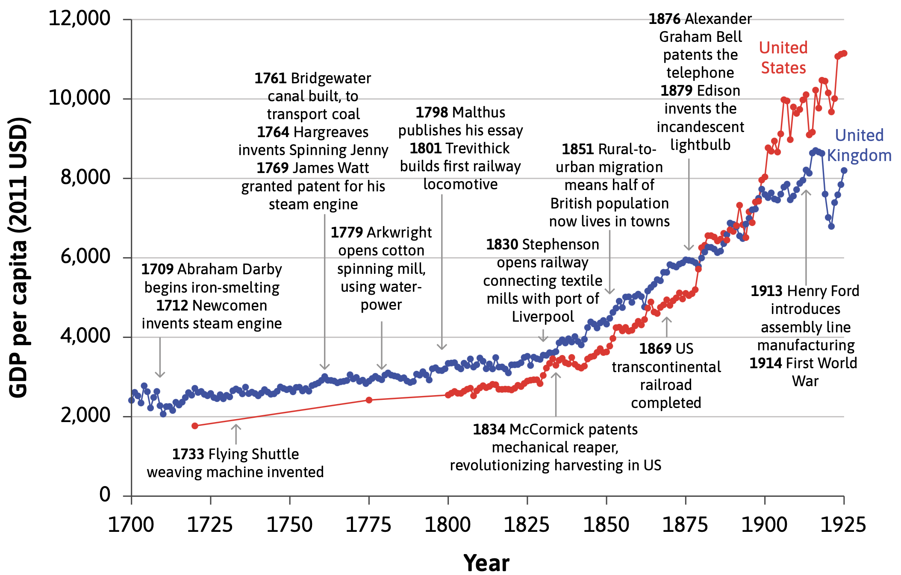
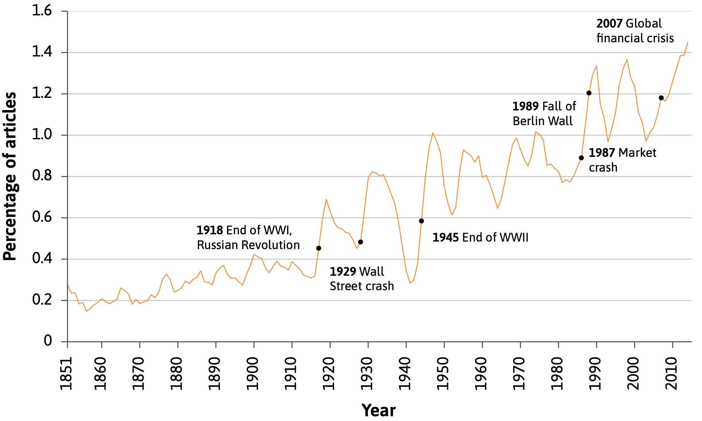
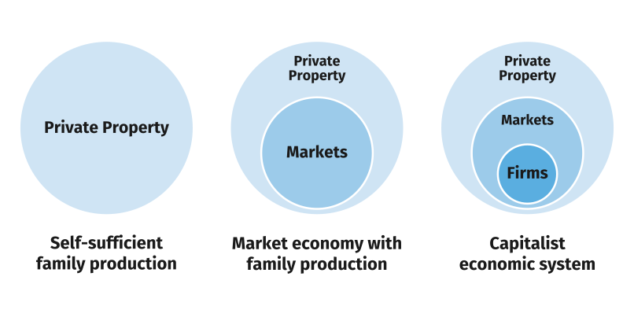
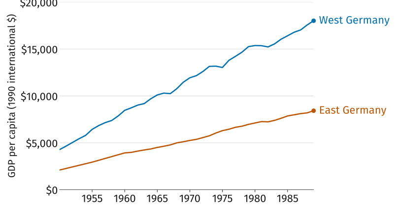
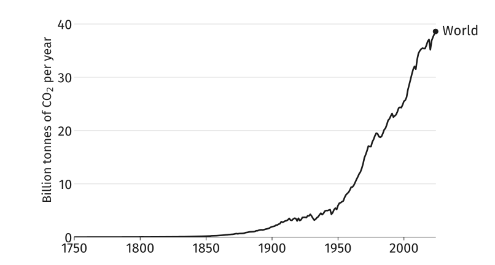
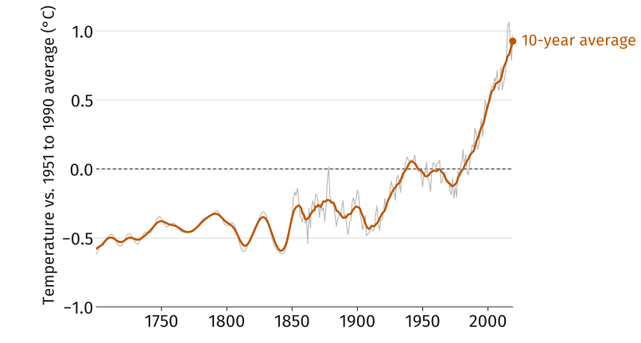
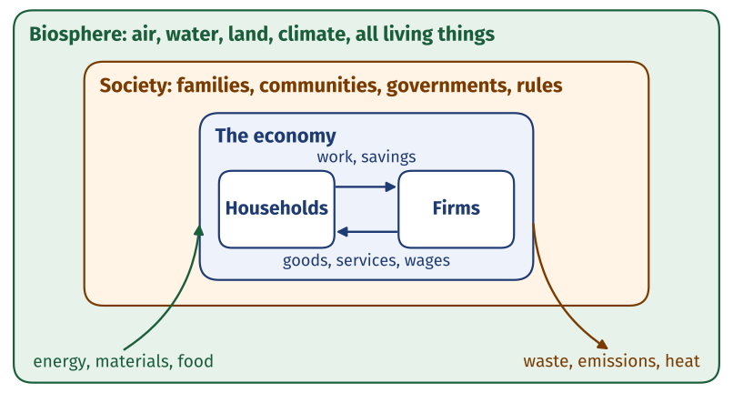

## History's Hockey Stick

:::: {.columns}
::: {.column width="65%"}
{fig-alt="GDP per person in the UK, US, China, India, and Mexico from the year 1000 to 2022. Every line is nearly flat along the bottom for centuries, then rises steeply after 1800. The US is highest at about $56,000, the UK near $38,000, then China, Mexico, and India below $20,000."}
:::

::: {.column width="35%"}
::: {.plain}
This plot shows GDP per capita, a proxy for living standards, for five countries over the last millennium.

::: {.fragment}
*When do living standards start to rise?* Estimate a year per country (worksheet, Activity 1), then compare with a neighbor.
:::
:::
:::
::::

## Zooming In: 1600 to Today

{fig-alt="The same GDP per person data from 1600 to 2022. All five lines sit below $3,500 until about 1800; the UK and US then climb through the 1800s and accelerate after 1950, while China, India, and Mexico rise steeply only after 1950."}

## Measuring Prosperity: GDP per Capita

::: {.plain}
*GDP* is a country's *output*: everything it produces in a year, valued at market prices. That total is also everyone's *total income*.

> "It adds up everything from nails to toothbrushes, tractors, shoes, haircuts, management consultancy, street cleaning, yoga teaching, plates, bandages, books, and the millions of other services and products in the economy."
> [Diane Coyle, economist]{.who}

::: {.fragment}
Larger countries will have higher GDP simply because they have more people, so divide by population to get *GDP per capita*.
:::
:::

## The Founding Question of Economics

:::: {.columns}
::: {.column width="70%"}
- *Why, over the past three centuries, have some countries prospered while others have not?*
- This is one of the oldest and most important questions in economics
- In fact, Adam Smith, widely regarded as the father of modern economics, put it in the title of his most famous book: [An Inquiry into the Nature and Causes of the Wealth of Nations]{.book}
:::

::: {.column width="30%"}
{fig-alt="Bronze statue of Adam Smith on the Royal Mile in Edinburgh, standing in eighteenth-century dress with a hand on a beehive and plough, St Giles' Cathedral behind him under a blue sky."}
:::
::::

## Adam Smith (1723–1790)

- His most famous idea, the *invisible hand*: markets coordinate the decisions of millions of strangers with no one planning it.

  > "It is not from the benevolence of the butcher, the brewer, or the baker, that we expect our dinner, but from their regard to their own interest."

::: {.fragment}
- According to him, prosperity came from the *division of labor/specialization*, which is limited by the *extent of the market*.
  - Pin factory example: ten workers, each doing one or two of 18 steps, made close to 50,000 pins a day. Working alone, none could have made twenty.
  - However, that many pins need buyers far beyond the town. Canals and trade increased the extent of the market.
:::

## The Technological Revolution

{width="80%" fig-alt="GDP per capita in the United Kingdom and the United States from 1700 to 1925, in 2011 US dollars, with a timeline of inventions marked along the curve: Newcomen's steam engine in 1712, the flying shuttle in 1733, the Bridgewater canal, spinning jenny, and Watt's steam engine in the 1760s, Arkwright's water-powered mill in 1779, the first railway locomotive in 1801, Stephenson's Liverpool railway in 1830, McCormick's reaper in 1834, the US transcontinental railroad in 1869, Bell's telephone in 1876, Edison's lightbulb in 1879, and Ford's assembly line in 1913. The UK line rises from about $2,500 to $8,000; the US line starts lower, overtakes the UK around 1880, and reaches about $11,000 by 1925."}

## Technology and Technological Progress

- The upward kink in the hockey stick coincided with the *Industrial Revolution* i.e. major technological advances in textiles, energy, and transportation.
- In everyday language, "technology" refers to machinery, equipment, and devices. In economics the word means something broader:
  - *Technology*: A process that takes a set of materials and other inputs, including the work of people and machines, and creates an output. E.g. a cake recipe.
- *Technological progress* is a change in technology that reduces the amount of resources (labor, machines, land, energy, time) needed to produce a given amount of output.

## The Capitalist Revolution

::: {.takeaway}
How did a world in which living conditions barely changed become one of continuous technological revolution, with each generation better off than the last?
:::

::: {.fragment}
A big part of the answer is the *capitalist revolution*: the emergence in the eighteenth century of a new way of organizing the economy that we now call *capitalism*. It raised what one worker could produce in two ways.
:::

::: {.fragment}
- Firms competing in markets had *incentives to adopt* new technology, and could afford capital no family could
- Firms and world markets allowed *specialisation* on an unprecedented scale
:::

## The Rise of Capitalism

{.nostretch width="72%" fig-alt="Percentage of New York Times articles mentioning capitalism, 1851 to 2015. The share rises from about 0.2 percent in the 1850s to around 1.4 percent by 2015, with spikes after the end of the First World War and the Russian Revolution in 1918, the 1929 Wall Street crash, the end of the Second World War in 1945, the 1987 market crash, the fall of the Berlin Wall in 1989, and the 2007 global financial crisis."}

::: {.figcap}
Share of [New York Times]{.book} articles that mention "capitalism", 1851 to 2015. Source: CORE Figure 1.13.
:::

## Defining Capitalism

::: {.plain}
In everyday speech "capitalism" can mean many different things. Here we define it formally as
:::

::: {.takeaway}
*Capitalism* is an economic system characterized by a particular combination of institutions: *private property*, *markets*, and *firms*
:::

- An *economic system* is a way of organizing the economy that is distinctive in its basic institutions
- *Institutions* are the laws and informal rules that regulate social interactions among people, and between people and the biosphere, sometimes also termed the rules of the game

## The Three Institutions of Capitalism

- *Private property*: the right to exclude others from the use of something, to benefit from its use, and to exchange it with others
- *Markets*: a way of connecting people who may mutually benefit by exchanging goods and services, through a process of buying and selling. Taking part is voluntary, and buyers and sellers compete
- *Firms*: a way of organizing production in which one or more individuals own a set of capital goods, pay wages to employees, direct their work, and sell the goods and services produced on markets with the intention of making a profit

## From Family Production to Capitalism

{fig-alt="Three panels of nested circles. First, one circle labelled private property: self-sufficient family production. Second, a smaller circle labelled and markets inside the private property circle: a market economy with family production. Third, a still smaller circle labelled and firms inside both: a capitalist economic system."}

::: {.takeaway}
Worksheet, Activity 2: pair up and work through both questions.
:::

## Did Capitalism Cause the Take-off?

- Capitalism spread and living standards rose at the same time. But *correlation is not causation*: something else could have caused both, or rising living standards might have caused capitalism to spread
- To find out, economists look for a *natural experiment*: a study that exploits a difference in conditions between two populations that arose for external reasons, such as a difference in laws or policies
- The division of Germany after the Second World War is one. Living standards in the two regions were similar before the war; afterwards the same people, with the same history, lived under a capitalist West and a centrally planned East

## Central Planning versus Capitalism

{fig-alt="GDP per capita in West Germany and East Germany from 1950 to 1989, in 1990 international dollars. West Germany starts near $4,300 and rises to about $18,000; East Germany starts near $2,100 and rises to about $8,400. East Germany stays at roughly half the Western level throughout."}

## Why Not Everywhere?

::: {.plain}
Most countries today are capitalist. Why has sustained growth reached some and not others? Two parts of the answer:
:::

- *Colonialism*: in India, living standards did not rise substantially until well after independence from British rule. In much of Latin America, independence in the early nineteenth century did not bring a change in economic fortunes
- *Institutions and politics*: not all capitalist economies are equally successful. Private property, markets, or firms may fail, and governments differ in how well they regulate them and provide essential public goods such as infrastructure, education, and the rule of law

## The Other Hockey Stick

{fig-alt="World carbon dioxide emissions from fossil fuels and industry, 1750 to 2024, in billion tonnes per year. Essentially zero until 1850, then rising, and rising steeply after 1950 to about 39 billion tonnes in 2024. The same shape as the GDP chart."}

::: {.figcap}
World carbon dioxide emissions from fossil fuels and industry, 1750 to 2024.
:::

## Rising Temperatures

{fig-alt="Northern Hemisphere temperature from 1700 to 2019, shown as the difference from the 1951 to 1990 average in degrees Celsius. The annual series in grey fluctuates around or below zero for two centuries; the ten-year average in orange stays near minus 0.3 until about 1900, then climbs steeply after 1950 to about plus 0.9 degrees by 2019."}

## The Economy and the Biosphere

{fig-alt="Three nested boxes. The outer box is the biosphere: air, water, land, climate, all living things. Inside it is society: families, communities, governments, rules. Inside that is the economy, drawn as households and firms exchanging work and savings for goods, services, and wages. An arrow brings energy, materials, and food from the biosphere into the economy; another sends waste, emissions, and heat back out."}

## What Is Economics? 

::: {.takeaway}
*Economics* is the study of how people interact with each other and with their natural environment in producing and acquiring their livelihoods, and how this changes over time and differs across societies.
:::

- In the next two weeks: how people and firms make decisions, and why specialization and trade make everyone better off
- Later in the course: how firms set prices, how markets with many buyers and sellers work, and when markets fail, including in their effects on the environment

## What to Do Next

- Read sections 1.2, 1.5, and 1.8 closely, with the *guided reading questions* in hand; skim the rest of the assigned reading
- Go over the *slides* and the *lecture notes*, both posted on the course website
- Work the *practice problems*
- *Quiz 1 is Monday*: four questions, two from the practice problems, one from the guided reading, one you have not seen

## Sources {.smaller}

- GDP per person: Maddison Project Database 2023 (Bolt and van Zanden), via Our World in Data. Five countries shown; ten-year moving average.
- CO$_2$ emissions: Global Carbon Budget 2024 (Friedlingstein et al.), via Our World in Data.
- Northern Hemisphere temperature: NASA GISTEMP, via Our World in Data (CORE Figure 1.2b).
- Two Germanies: Conference Board, Total Economy Database 2015, via Our World in Data (CORE Figure 1.16).
- Technological revolution and capitalism in the news: CORE Econ, [The Economy 2.0: Microeconomics]{.book}, Figures 1.5 and 1.13. The institutions diagram is adapted from CORE Figure 1.14.
