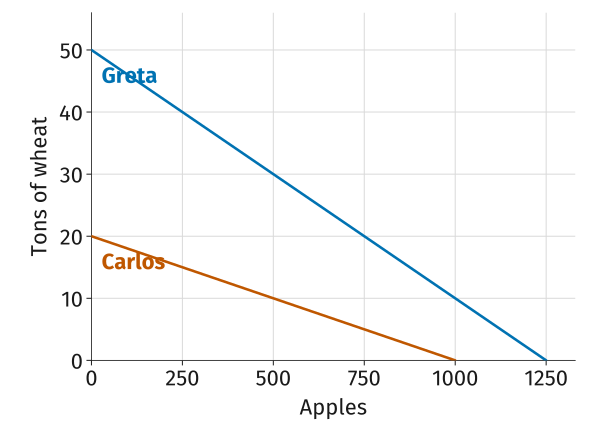
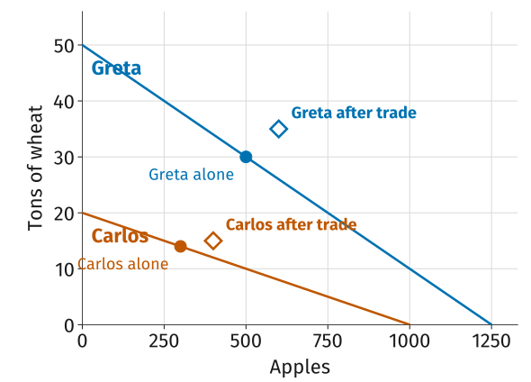
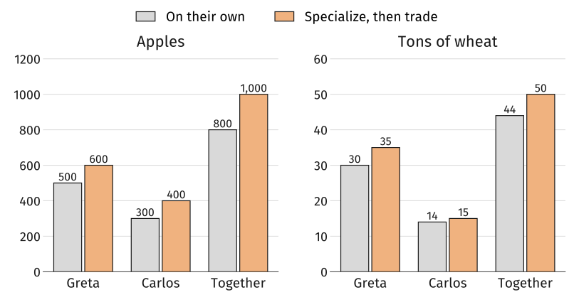
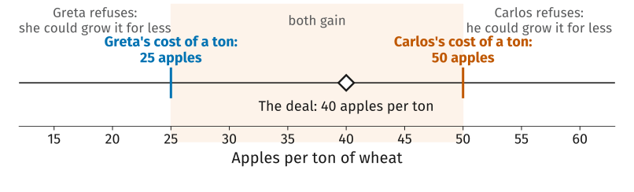

## Where We Left Off

- A decision is a comparison: *benefit* against *economic cost*, which includes the *opportunity cost* of what you give up.
- Every number in that comparison belonged to one person choosing between two options.
- Today the same question, what do you give up, decides who should do what when *two* people can each do two things.

::: {.gap}
:::

::: {.plain}
*Today*: [specialization]{.book}, [absolute advantage]{.book} and [comparative advantage]{.book}, and the [gains from trade]{.book}. One example with two farmers carries the whole lecture.
:::

## Nobody Makes Their Own Shoes

::: {.plain}
Almost nothing you used today was made by you.
:::

- *People* specialize: some weld, some teach, some design buildings.
- *Firms* specialize: often in a single step of making a single good.
- *Countries* specialize: gold and knitwear are Cambodia's largest exports; Singapore's are integrated circuits.

::: {.fragment}
::: {.takeaway}
Each of us produces a tiny slice of what we consume and gets the rest by *exchange*. That is what *specialization* means.
:::
:::

## Why Specialize?

::: {.incremental}
- *Learning by doing*: we acquire skills as we produce things.
- *Differences in ability*: from skill, or from the soil, climate, and resources around us.
- *Economies of scale*: producing many units of a good often costs less per unit than producing a few.
:::

::: {.fragment}
Adam Smith's pin factory, from Lecture 2, was all three at once: ten workers splitting eighteen steps made nearly 50,000 pins a day, when alone none could have made twenty.
:::

## Two People, Two Crops

::: {.plain}
Greta and Carlos each have a year to farm. Each can grow apples, wheat, or some of both.
:::

| If the whole year goes into one crop | Apples | Tons of wheat |
|:--|--:|--:|
| Greta | 1,250 | 50 |
| Carlos | 1,000 | 20 |

::: {.figcap}
CORE Figure 2.2a
:::

::: {.fragment}
Greta grows more of *both*. Hands up: is there any reason for her to deal with Carlos at all?
:::

## Greta Has an Absolute Advantage in Both

::: {.takeaway}
*Absolute advantage*: being able to produce more of a good than someone else, using the same amount of inputs.
:::

- In apples, 1,250 against 1,000. In wheat, 50 against 20. Greta wins both.
- The intuition most people start with: she should do everything herself, and Carlos has nothing to offer her.
- That intuition is wrong, and seeing why is the point of today.

## Ask the Opportunity Cost Question

::: {.plain}
Not "who grows more?" but "what does each of them *give up*?" Greta's year is 1,250 apples or 50 tons, so each ton of wheat costs her 1,250 / 50 = 25 apples.
:::

| Opportunity cost of... | 1 ton of wheat | 1 apple |
|:--|--:|--:|
| Greta | 1,250 / 50 = *25 apples* | 50 / 1,250 = 0.04 tons |
| Carlos | 1,000 / 20 = 50 apples | 20 / 1,000 = *0.02 tons* |

::: {.figcap}
CORE Figure 2.2b
:::

::: {.fragment}
A ton of wheat costs Carlos twice as many apples as it costs Greta. Turn it round and an apple costs Greta twice as much wheat as it costs Carlos.
:::

## Carlos Has a Comparative Advantage in Apples

::: {.takeaway}
*Comparative advantage*: being able to produce a good at a lower *opportunity cost* than someone else.
:::

- An apple costs Carlos 0.02 tons of wheat and Greta 0.04: Carlos has the comparative advantage in *apples*.
- A ton of wheat costs Greta 25 apples and Carlos 50: Greta has the comparative advantage in *wheat*.
- Greta out-grows Carlos in apples and still has no comparative advantage in them. Nobody has one in everything: relatively cheaper at one good means relatively dearer at the other.

## The Same Numbers as a Picture

:::: {.columns}
::: {.column width="46%"}
- Each line is every mix of apples and wheat that person could grow in a year.
- Greta's is *higher* everywhere. Carlos's is *flatter*: he gives up less wheat per apple.

::: {.takeaway}
Height is absolute advantage. Slope is comparative advantage.
:::
:::

::: {.column width="54%"}
{fig-alt="Apples on the horizontal axis, tons of wheat on the vertical. Two straight lines: Greta's runs from 50 tons of wheat down to 1,250 apples, Carlos's from 20 tons down to 1,000 apples. Greta's line lies above Carlos's everywhere, but Carlos's is the flatter of the two."}
:::
::::

## On Their Own

::: {.plain}
With nobody to trade with, each eats only what they grow. Say Greta puts 40% of her year into apples and Carlos puts 30% into his.
:::

|  | Apples | Tons of wheat |
|:--|--:|--:|
| Greta | 0.4 × 1,250 = 500 | 0.6 × 50 = 30 |
| Carlos | 0.3 × 1,000 = 300 | 0.7 × 20 = 14 |
| **Together** | **800** | **44** |

::: {.fragment}
This is *self-sufficiency*: consumption equals production, person by person. Every slide from here compares against these numbers.
:::

## Now Let Them Specialize

::: {.plain}
Each grows only the crop in which they have the *comparative advantage*: Greta wheat, Carlos apples.
:::

|  | Apples | Tons of wheat |
|:--|--:|--:|
| On their own | 800 | 44 |
| Specialized | **1,000** | **50** |

::: {.fragment}
The same two people, the same year, the same fields: 200 more apples and 6 more tons of wheat. Nothing was invented and nobody worked harder.
:::

## Specializing on Its Own Is Not Enough

::: {.plain}
Look at what each of them is actually holding at the end of the year.
:::

|  |  | On their own | **Produces** |
|:--|:--|--:|--:|
| Greta | Apples | 500 | **0** |
|  | Wheat | 30 | **50** |
| Carlos | Apples | 300 | **1,000** |
|  | Wheat | 14 | **0** |

::: {.fragment}
Greta has 50 tons of wheat and not one apple. Carlos has 1,000 apples and no wheat. Specializing only pays off if they can *trade*.
:::

## Striking a Deal

::: {.plain}
Greta sells Carlos 15 tons of wheat for 600 apples.
:::

|  |  | On their own | Produces | **Trades** | **Consumes** |
|:--|:--|--:|--:|:--|--:|
| Greta | Apples | 500 | 0 | **buys 600** | **600** |
|  | Wheat | 30 | 50 | **sells 15** | **35** |
| Carlos | Apples | 300 | 1,000 | **sells 600** | **400** |
|  | Wheat | 14 | 0 | **buys 15** | **15** |
| Together | Apples | 800 | 1,000 |  | **1,000** |
|  | Wheat | 44 | 50 |  | **50** |

::: {.figcap}
CORE Figure 2.2c
:::

::: {.fragment}
Compare the first column of numbers with the last: every single number is bigger.
:::

## Both End Up Beyond Their Own Line

:::: {.columns}
::: {.column width="46%"}
- Filled dots: what each grew, and ate, on their own.
- Open diamonds: what each eats after specializing and trading. Both sit *above* that person's own line.

::: {.takeaway}
Trade lets each of them consume a mix neither could have grown alone.
:::
:::

::: {.column width="54%"}
{fig-alt="The same two lines, Greta's from 50 tons of wheat to 1,250 apples and Carlos's from 20 tons to 1,000 apples. Filled dots mark each person alone: Greta at 500 apples and 30 tons, Carlos at 300 apples and 14 tons, each on that person's own line. Open diamonds mark consumption after trade: Greta at 600 apples and 35 tons, Carlos at 400 apples and 15 tons. Both diamonds sit above that person's own line, at combinations neither could have produced alone."}
:::
::::

## Everyone Has More of Both

{fig-alt="Two panels of paired bars comparing on their own against specialize then trade. Apples: Greta rises from 500 to 600, Carlos from 300 to 400, and the two together from 800 to 1,000. Tons of wheat: Greta rises from 30 to 35, Carlos from 14 to 15, and together from 44 to 50. Every bar rises."}

## Why Did That Work?

::: {.plain}
Greta bought 600 apples from Carlos even though she could have grown them in less of her own time. Why was that sensible?
:::

- Every hour Greta spends on apples costs a lot of wheat. An hour of Carlos's costs only a little.
- So the question was never who is better at apples, but whose apples cost less *in wheat*: Carlos's.
- Putting each person's time where it gives up the least is what makes the total grow.

::: {.takeaway}
Being worse at everything does not stop you from being the cheaper source of something.
:::

## The Price Decides How the Gain Is Split

- The deal, 600 apples for 15 tons, is a *price*: 40 apples per ton of wheat.
- Each trades only at a price better than growing the wheat alone.

{.nostretch width="70%" fig-alt="A number line of prices for a ton of wheat, in apples, from 15 to 60. A blue mark at 25 is labelled Greta's cost of a ton, and an orange mark at 50 is labelled Carlos's cost of a ton. The band between them is shaded and labelled both gain; below 25 is labelled Greta refuses, she could grow it for less, and above 50 is labelled Carlos refuses, he could grow it for less. A diamond at 40 marks the deal, 40 apples per ton."}

::: {.takeaway}
Any price between 25 and 50 leaves both better off. Near 25 most of the gain goes to Carlos; near 50, to Greta.
:::

## Your Turn

::: {.plain}
Same two farmers, a different bargain. This is Exercise 2.3 in the textbook.
:::

::: {.incremental}
- A ton of wheat now buys 35 apples, and Greta sells 16 tons. Work out what each of them ends up eating. Are both still better off than on their own?
- A ton of wheat buys only 20 apples. What happens to the deal?
- Compare the 35-apple price with the 40-apple deal. Whose share of the gain grew?
:::

## So Why Do Markets Matter?

- Specializing means depending on strangers for everything you did not make. Those 50,000 pins need buyers far beyond the town.
- Smith's phrase for it: the division of labor is *limited by the extent of the market*. No market, no reason to specialize.
- A market is where the counterparty is found, the price agreed, and the deal carried out, at a scale no pair of neighbors could manage.

> Markets accomplish an extraordinary result: unintended cooperation on a global scale.
> [CORE, Section 2.3]{.who}

## The Other Way to Organize Specialists: The Firm

- Inside the pin factory nobody buys pins from the worker at the next bench. A manager assigns the eighteen steps and the firm sells the pins.
- Kutesmart, a Chinese tailoring firm, split a skilled tailor's job into more than 300 operations, each done by a worker with no tailoring skills.
- Markets coordinate specialists through *prices*; firms coordinate them through *direction*. Capitalism expanded both.

::: {.takeaway}
Next week we go inside the firm: what it costs to make things, and how a firm chooses its price.
:::

## What the Model Leaves Out

- No transport costs, no time spent haggling, no risk of the other side reneging.
- Complete specialization is assumed. In practice people rarely put 100% of anything into one activity.
- Specializing makes you dependent: a wheat grower whose crop fails has nothing to eat and nothing to sell.
- Remember from last time: a model earns its keep by being useful, not by being complete.

## What to Do Next

- Read section 2.3 closely with the *guided reading questions* in hand.
- Go over the *slides* and the *lecture notes*, both posted on the course website.
- Work the *practice problems*.
- No class Monday, September 7 (Labor Day). We meet again Wednesday, September 9.
- *Quiz 2 is that Wednesday* and covers Lectures 3 and 4.
