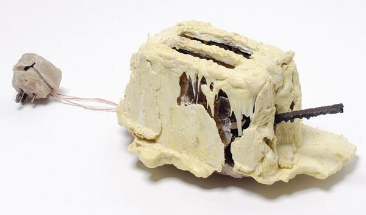
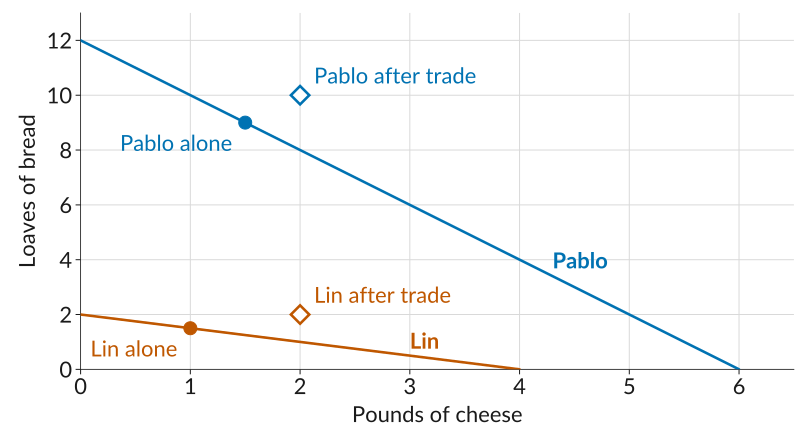

## What Does a Free Seat Cost?

:::: plain
**A concert hall has unsold seats an hour before the show and lets students in free. The opportunity cost to the hall of admitting a student is:**

::: gap
:::

a\) The regular ticket price.

b\) The hall's cost per seat for the evening.

c\) Close to zero, since the seat would otherwise be empty.

d\) Negative, since the student will buy snacks.
::::

## The Sunk Cost Fallacy

::: plain
The hall is paid for and the seat would otherwise sit empty. What does letting one more student in really cost?
:::

-   It is tempting to count the hall's spending on the evening, but that money is spent whether the student comes in or not.
-   A *sunk cost* is a cost that has already been incurred and cannot be recovered.
-   Letting sunk costs sway what you decide next is such a common mistake that it has its own name: the *sunk cost fallacy*.
    -   For example, sitting through a movie you are not enjoying because you paid for the ticket.

## Where We Left Off

-   Individuals make *choices* by weighing *costs* and *benefits*.
-   The *economic cost* of an action is more than its direct cost: $$\text{economic cost} = \text{direct cost} + \text{opportunity cost}$$
-   *Opportunity cost*: the value of the next-best alternative you give up.
-   So far, we have said that capitalism expanded our opportunities to specialize, by enlarging the role of both *firms* and *markets*.

::: takeaway
*Today*: why specialization and trading make us better off.
:::

## I, Pencil (Leonard Read, 1958)

:::: {.columns}
::: {.column width="70%"}
::: plain
A pencil tells the story of how it was made:
:::

-   Wood from Oregon, graphite from Sri Lanka, brass from mined zinc and copper, an eraser from rapeseed oil.
-   Thousands of workers involved, loggers, miners, sailors, none of whom set out to make a pencil.
-   No single person knows how to make one from scratch.
-   No one is in charge: markets coordinate all of them, Smith's *invisible hand* at work.
:::

::: {.column width="30%"}
{height="480" fig-alt="A plain wooden pencil, sharpened, with a metal ferrule and a pink eraser, standing upright."}
:::
::::

## The £4 Toaster

:::: {.columns}
::: {.column width="55%"}
-   In 2009, the designer Thomas Thwaites set out to build a toaster from scratch.
-   He mined his own iron ore, smelted it, made plastic from potato starch, and drew his own copper wire.
-   Nine months and about £1,187 later, his toaster worked for about five seconds before it began to melt.
-   The store sold the same toaster for £3.94, about \$5.
:::

::: {.column width="45%"}
{fig-alt="Thomas Thwaites' homemade toaster: a lumpy appliance with a rough, cracked beige potato-starch shell, exposed metal parts, and a bare wire running to a crude plug."}
:::
::::

## We All Specialize

::: takeaway
*Specialization*: each person does just one or a few of the large number of tasks necessary to complete some project or reach some goal.
:::

-   *People* specialize: some weld, some teach, some design buildings.
-   *Firms* specialize: often in a single step of making a single good.
-   *Countries* specialize: gold and knitwear are Cambodia's largest exports; Singapore's are integrated circuits.

::: fragment
This seems obvious, but just two centuries ago, most families grew their own food and made much of their own clothing.
:::

## Why Specialize?

::: incremental
-   *Learning by doing*: we acquire skills as we produce things.
-   *Differences in ability*: from skill, or from the soil, climate, and resources around us.
-   *Economies of scale*: producing many units of a good often costs less per unit than producing a few.
:::

## Meal Prep

::: plain
Pablo and Lin are neighbors. Each spends about 8 hours on Sunday baking bread and making cheese for the week's meals. If they spent the whole day on just one food:
:::

::: gap
:::

|       | Loaves of bread | Pounds of cheese |
|:------|:---------------:|:----------------:|
| Pablo |       12        |        6         |
| Lin   |        2        |        4         |

::: plain
They can also split the day: with half his time on each food, Pablo would make 6 loaves and 3 pounds of cheese.
:::

:::: fragment
::: takeaway
*Think, pair, share*: Pablo can make more of *both* goods. Is there still a gain from trading with Lin? Think for a minute, then see what your neighbor thinks.
:::
::::

## Absolute Advantage

::: takeaway
A person or a country has an *absolute advantage* in the production of a particular good if, given a set of available inputs, they can produce more of it than another person or country.
:::

-   Pablo has an absolute advantage in both goods: 12 loaves versus 2, and 6 pounds of cheese versus 4.
-   So it may seem that Pablo has nothing to gain from trading with Lin.
-   But that turns out not to be right. To see why, we need to look at each person's *opportunity cost* of producing each good, not at who makes more.

## Opportunity Costs

::: plain
So what does each of them give up? Pablo's Sunday can produce 12 loaves or 6 pounds of cheese, so for Pablo each pound of cheese costs 12 / 6 = 2 loaves of bread.
:::

::: gap
:::

| Opportunity cost of... |    1 pound of cheese |       1 loaf of bread |
|:-----------------------|---------------------:|----------------------:|
| Pablo                  |    12 / 6 = 2 loaves | 6 / 12 = 0.5 pounds |
| Lin                    | 2 / 4 = 0.5 loaves |      4 / 2 = 2 pounds |

::: fragment
A pound of cheese costs Pablo four times as much bread as it costs Lin. The other way around, a loaf costs Lin four times as much cheese as it costs Pablo.
:::

## Comparative Advantage

::: takeaway
A person or a country has a *comparative advantage* in the production of a particular good if the cost to them of producing it, relative to the cost of another good, is lower than for another person or a country.
:::

-   Cost of a pound of cheese: 0.5 loaves for Lin, 2 loaves for Pablo.\
    $\Rightarrow$ Lin has the comparative advantage in *cheese*.
-   Cost of a loaf of bread: 0.5 pounds for Pablo, 2 pounds for Lin.\
    $\Rightarrow$ Pablo has the comparative advantage in *bread*.
-   Nobody can have a comparative advantage in everything: relatively cheaper at one food means relatively more expensive at the other.

## The Example in a Picture

:::::: columns
:::: {.column width="46%"}
-   Each line shows every mix of bread and cheese one person can make.
-   This is called their production possibilities frontier, or *PPF*.
-   Pablo's line is *higher*; Lin's is *flatter*: cheese costs Lin less bread.

::: takeaway
Height shows absolute advantage; slope shows comparative advantage.
:::
::::

::: {.column width="54%"}
{fig-alt="Pounds of cheese on the horizontal axis, loaves of bread on the vertical. Two straight lines: Pablo's runs from 12 loaves down to 6 pounds of cheese, Lin's from 2 loaves down to 4 pounds. Pablo's line lies above Lin's everywhere, but Lin's is the flatter of the two."}
:::
::::::

## Self-Sufficiency

::: plain
If they cannot trade, each eats exactly what they make. Suppose each of them spends *75% of their time on bread and 25% on cheese*.
:::

::: gap
:::

::: totalrule
|              | Loaves of bread | Pounds of cheese |
|:-------------|----------------:|-----------------:|
| Pablo        |    0.75 × 12 = 9 |    0.25 × 6 = 1.5 |
| Lin          |   0.75 × 2 = 1.5 |      0.25 × 4 = 1 |
| **Total** |        **10.5** |          **2.5** |
:::

::: fragment
Under *self-sufficiency*, each person consumes exactly what they produce.
:::

## Specializing by Comparative Advantage

::: plain
Now suppose *each of them makes only the food in which they have the comparative advantage*: so Pablo makes bread, and Lin makes cheese.
:::

::: gap
:::

|              | Loaves of bread | Pounds of cheese |
|:-------------|:---------------:|:----------------:|
| On their own (total) |            10.5 |              2.5 |
| Specialized  |          **12** |            **4** |

::: fragment
The two of them now produce *1.5 more loaves and 1.5 more pounds of cheese* than before, with the same skills and the same hours. Total output went up just from rearranging who does what.
:::

## Specialization Without Trade

::: plain
Total output is higher, but look at what each of them ends up with.
:::

|       |        | On their own | **Specialized** |
|:------|:-------|:------------:|:------------:|
| Pablo | Bread  |            9 |       **12** |
|       | Cheese |          1.5 |        **0** |
| Lin   | Bread  |          1.5 |        **0** |
|       | Cheese |            1 |        **4** |

::: fragment
Pablo has 12 loaves and no cheese. Lin has 4 pounds of cheese and no bread. Specializing is only worthwhile if they can *trade*.
:::

## Specialization and Trade

::: plain
Now suppose they agree on a deal: *Lin sells Pablo 2 pounds of cheese for 2 loaves of bread*.
:::

::: totalrule2
|          |        | On their own | Specialized | **Trades**  | **Consumes** |
|:---------|:-------|:------------:|:--------:|:-----------:|:------------:|
| Pablo    | Bread  |            9 |       12 | **sells 2** |       **10** |
|          | Cheese |          1.5 |        0 | **buys 2**  |        **2** |
| Lin      | Bread  |          1.5 |        0 | **buys 2**  |        **2** |
|          | Cheese |            1 |        4 | **sells 2** |        **2** |
| **Total** | Bread  |         10.5 |       12 |             |       **12** |
|          | Cheese |          2.5 |        4 |             |        **4** |
:::

::: fragment
Compare the first column with the last: both of them now consume more of both goods.
:::

## Trade in the Picture

{fig-alt="The two production possibility frontiers, Pablo's from 12 loaves of bread to 6 pounds of cheese and Lin's from 2 loaves to 4 pounds. Filled dots mark each person on their own: Pablo at 1.5 pounds and 9 loaves, Lin at 1 pound and 1.5 loaves, each on their own line. Open diamonds mark consumption after trade: Pablo at 2 pounds and 10 loaves, Lin at 2 pounds and 2 loaves. Both diamonds sit above that person's own line, at combinations neither could have made alone."}

## Why Did That Work?

::: plain
Pablo bought 2 pounds of cheese from Lin, even though Pablo could have made them in less time. Why does that make sense?
:::

-   Every hour Pablo spends on cheese costs a lot of bread. An hour of Lin's costs only a little.
-   What matters is not who is better at making cheese, but whose cheese costs less *in bread*. That is Lin.

::: takeaway
Someone can be worse at producing everything and still have a comparative advantage in something.
:::

## Sharing the Gains from Trade

-   Their deal, 2 pounds of cheese for 2 loaves, comes down to a *price*: 1 loaf per pound of cheese.
-   Neither will trade at a price worse than making the food on their own:
    -   Lin sells only if the price is above 0.5 loaves per pound, the cost of making cheese.
    -   Pablo buys only if the price is below 2 loaves per pound, the cost of making cheese at home.
-   Any price between 0.5 and 2 loaves per pound makes both of them better off. Prices near 0.5 favor Pablo, and prices near 2 favor Lin.

## Questions

::: incremental
-   Suppose Taylor Swift types faster than any assistant. Should she answer her own fan mail?
-   You are better than your roommate at both cooking and cleaning. Should you do both?
-   Should the United States import goods that it could produce more cheaply at home?
-   Are there any downsides to specializing?
:::

## What to Do Next

-   Before next class: read section *2.3*, go over the *slides* and the *worksheet*, and work the *practice problems*.
-   While driving or at the gym, [listen to *An Economics Lesson from a Talking Pencil*, from Freakonomics Radio](https://freakonomics.com/podcast/an-economics-lesson-from-a-talking-pencil-update/).
-   No class Monday (Labor Day). *Quiz 2 is Wednesday, September 9* (Lectures 3 and 4).
-   Next week we go inside the firm: what it costs to make things, and how a firm chooses its price.