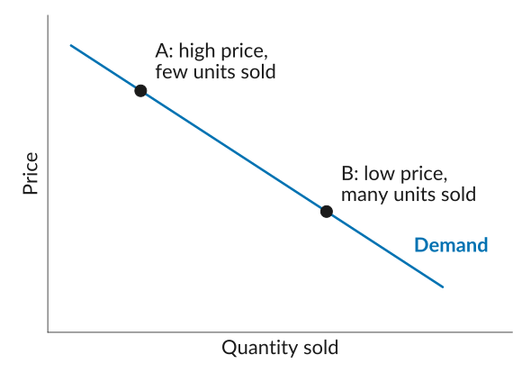
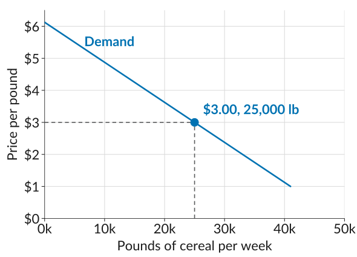

## Quiz Instructions

-   Write your *CWID legibly* in the space provided. If you do not have it memorized, it is perfectly fine to quickly check your phone before you start the quiz.
-   For the multiple-choice questions, use a pen or a pencil that is *dark enough*, and *fill in the boxes completely*. Do not tick.
-   For any open-ended questions, write your answer *inside the box* provided. The size of the box is a good indication of how long or short your answer should be.

## What Makes a Successful Business?

-   So far, we have seen that we prosper by specializing and trading, and that much of this activity is organized by *firms*.
-   For the next few weeks, we look inside the firm: how it makes decisions about what to produce, how much to produce, and at what price to sell.
-   By definition, the key goal of a business is to make a *profit*.
-   Some businesses have other goals too: IKEA started with the mission of making good furniture affordable for the many. But at the very least, the goal is still to be profitable, or at least not to make a loss.

## Profit

*Profit* is the difference between what a firm earns from selling its product and what it costs to produce that product:
$$\text{Profit} = \text{Total Revenue} - \text{Total Cost}$$

-   *Total revenue* is what comes in: if you sell $Q$ units at a price of $P$ each, then $R = P \times Q$.
-   *Total cost* is what producing those units costs you. Write it as $C(Q)$, a function that captures the cost of producing $Q$ units. 
$$\text{Profit} = \underbrace{P \times Q}_{\text{revenue, } R} - \underbrace{C(Q)}_{\text{total cost}}$$

## Do Higher Prices Always Mean Higher Profits?

|                          |           Ford |       Ferrari |
|:-------------------------|---------------:|--------------:|
| Vehicles sold (2024)     |    4.5 million |        13,752 |
| Sales                    | \$185.0 billion | \$7.2 billion |
| Profit                   |  \$5.9 billion | \$1.7 billion |
| Profit as a share of sales |       3% |      23% |

Could Ford charge a 23% margin on its F-150?

::: fragment
Some firms are able to *differentiate their product* from those of their competitors: it has characteristics that customers value and believe they cannot find elsewhere. Selling a differentiated product gives a firm *more control over its price*.
:::

## Creating Winning Brands: The Story of Lego

-   Of course, success takes more than the right price and quantity: a firm must anticipate what customers will want, build a reputation for quality, innovate, and keep its costs down.
-   Lego was founded in the 1930s by Ole Kirk Kristiansen, a carpenter in Billund, Denmark.
-   By 1962, its bricks were selling so widely that it built its own *airport* in Billund to reach customers around the world.
-   Today Lego is the largest toy maker in the world.
-   Other winning brands: Apple, IKEA, Nike, Coca-Cola, Trader Joe's, In-N-Out.

## Price-Quantity Trade-Off

::: plain
Why does charging a high price make sense for some firms but not for others? *Jot down your thoughts on the worksheet (Activity 1), then compare with a neighbor.*
:::

::: fragment
-   Note that $\text{Profit} = P \times Q - C(Q)$, so profit depends on both $P$ and $Q$, and the two are connected: *how much you can sell depends on the price you set*.
-   Set a higher price, and you sell less. Set a lower price, and you sell more.
-   So the firm faces a *trade-off* between price and quantity. This trade-off is captured by the *demand curve*.
:::

## The Demand Curve

:::::: columns
:::: {.column width="46%"}
::: takeaway
The *demand curve* shows the number of units that buyers would wish to buy at any given price.
:::

-   It slopes downward: at higher prices, buyers buy less. This is the *law of demand*.
-   The firm cannot choose price and quantity separately. It can only choose a *point on its demand curve*.
::::

::: {.column width="54%"}
{fig-alt="A downward-sloping demand curve, with price on the vertical axis and quantity sold on the horizontal axis, no numbers on either. Point A sits high on the curve: a high price with few units sold. Point B sits lower down: a low price with many units sold."}
:::
::::::

## The Price of Cheerios

:::::: columns
:::: {.column width="46%"}
-   In 1989, General Mills launched *Apple Cinnamon Cheerios*. Suppose you are the manager who sets its price.
-   Producing the cereal costs \$2.00 per pound, so $C(Q) = 2Q$.
-   The economist Jerry Hausman estimated its demand curve from data on cereal purchases in US cities, shown on the right.
::::

::: {.column width="54%"}
{fig-alt="A straight downward-sloping demand curve for Apple Cinnamon Cheerios, with price per pound from 0 to 6 dollars on the vertical axis and pounds of cereal per week from 0 to 50,000 on the horizontal axis. A marked point with dashed guides to both axes shows that at a price of 3 dollars, quantity demanded is 25,000 pounds per week."}
:::
::::::

## Worksheet, Activity 2

::: plain
Reading quantities off the demand curve at five candidate prices gives the schedule below. Fill in revenue, cost, and profit, draw the four curves, and decide: *which price would you set?*
:::

| Price per pound, $P$ |  \$3.00 |  \$3.50 |  \$4.00 |  \$4.50 |  \$5.00 |
|:----------------|-------:|-------:|-------:|-------:|-------:|
| Pounds per week, $Q$ | 25,000 | 21,000 | 17,000 | 13,000 |  9,000 |

## What to Do Next

-   Before next class: read sections *7.1 and 7.2*, skipping the isoprofit curves (Figures 7.2a to 7.4b and the text around them).
-   We will find the profit-maximizing price using marginal reasoning instead.
-   But before that, next class we take a closer look at costs: how they behave as a firm produces more, and why producing at a larger scale usually lowers the cost per unit.

