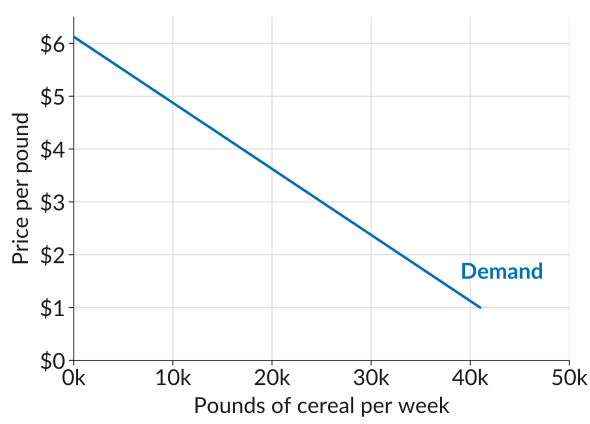
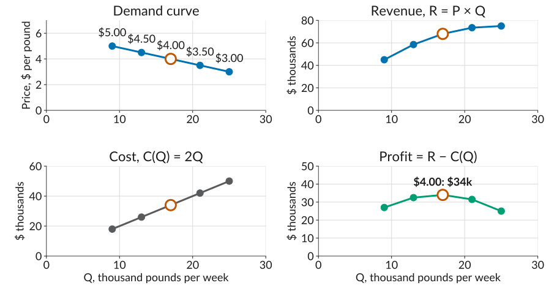
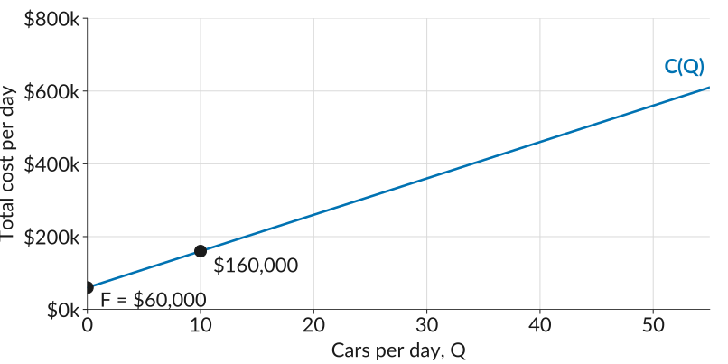
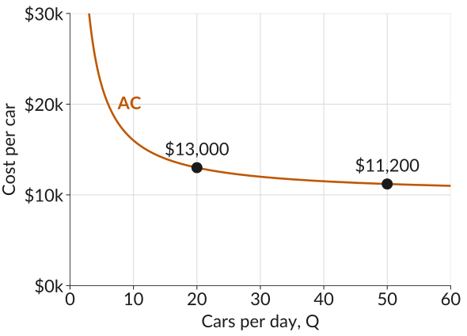
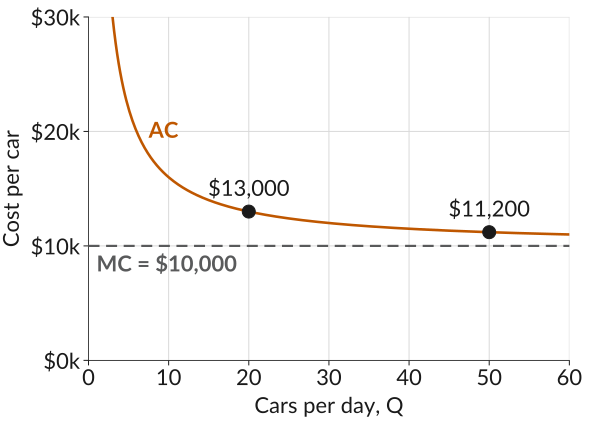

## Last Class: The Price of Cheerios

$$\text{Profit} = \underbrace{P \times Q}_{\text{revenue}} - \underbrace{C(Q)}_{\text{total cost}}$$

::: plain
- $P$ is the price per pound of cereal,
- $Q$ is the number of pounds sold, and 
- $C(Q)$ is the total cost of producing $Q$ pounds.
:::

::: plain
How should the firm set $P$ to maximize profit?
:::

::: fragment
*Remember*: a higher price sells fewer pounds and a lower price sells more, and this trade-off is given by the *demand curve*.
:::

## The Demand Curve

:::::: columns
:::: {.column width="46%"}
-   The *demand curve* shows the number of units that buyers would wish to buy at any given price.
-   It slopes downward: at higher prices, buyers buy less. This is the *law of demand*.
-   The firm cannot choose price and quantity separately. It can only choose a *point on its demand curve*.
::::

::: {.column width="54%"}
{fig-alt="The straight downward-sloping demand curve for Apple Cinnamon Cheerios, price per pound from 0 to 6 dollars on the vertical axis and pounds per week from 0 to 50,000 on the horizontal axis, labelled Demand."}
:::
::::::

## Worksheet, Activity 2

::: plain
Reading quantities off the demand curve at five prices gives the schedule below. With $C(Q) = 2Q$, fill in revenue, cost, and profit.
:::

::: gap
:::

|                      |        |        |        |        |        |
|:---------------------|-------:|-------:|-------:|-------:|-------:|
| Price per pound, $P$ | \$3.00 | \$3.50 | \$4.00 | \$4.50 | \$5.00 |
| Pounds per week, $Q$ | 25,000 | 21,000 | 17,000 | 13,000 |  9,000 |
| Total revenue, $R = P \times Q$ |  |  |  |  |  |
| Total cost, $C = 2Q$ |  |  |  |  |  |
| Profit $= R - C$ |  |  |  |  |  |

: {tbl-colwidths="[35,13,13,13,13,13]"}

## Worksheet, Activity 2

::: plain
Reading quantities off the demand curve at five prices gives the schedule below. With $C(Q) = 2Q$, fill in revenue, cost, and profit.
:::

::: gap
:::

|                      |        |        |        |        |        |
|:---------------------|-------:|-------:|-------:|-------:|-------:|
| Price per pound, $P$ | \$3.00 | \$3.50 | \$4.00 | \$4.50 | \$5.00 |
| Pounds per week, $Q$ | 25,000 | 21,000 | 17,000 | 13,000 |  9,000 |
| Total revenue, $R = P \times Q$ | 75,000 | 73,500 | 68,000 | 58,500 | 45,000 |
| Total cost, $C = 2Q$ |  |  |  |  |  |
| Profit $= R - C$ |  |  |  |  |  |

: {tbl-colwidths="[35,13,13,13,13,13]"}

## Worksheet, Activity 2

::: plain
Reading quantities off the demand curve at five prices gives the schedule below. With $C(Q) = 2Q$, fill in revenue, cost, and profit.
:::

::: gap
:::

|                      |        |        |        |        |        |
|:---------------------|-------:|-------:|-------:|-------:|-------:|
| Price per pound, $P$ | \$3.00 | \$3.50 | \$4.00 | \$4.50 | \$5.00 |
| Pounds per week, $Q$ | 25,000 | 21,000 | 17,000 | 13,000 |  9,000 |
| Total revenue, $R = P \times Q$ | 75,000 | 73,500 | 68,000 | 58,500 | 45,000 |
| Total cost, $C = 2Q$ | 50,000 | 42,000 | 34,000 | 26,000 | 18,000 |
| Profit $= R - C$ |  |  |  |  |  |

: {tbl-colwidths="[35,13,13,13,13,13]"}

## Worksheet, Activity 2

::: plain
Reading quantities off the demand curve at five prices gives the schedule below. With $C(Q) = 2Q$, fill in revenue, cost, and profit.
:::

::: gap
:::

|                      |        |        |        |        |        |
|:---------------------|-------:|-------:|-------:|-------:|-------:|
| Price per pound, $P$ | \$3.00 | \$3.50 | \$4.00 | \$4.50 | \$5.00 |
| Pounds per week, $Q$ | 25,000 | 21,000 | 17,000 | 13,000 |  9,000 |
| Total revenue, $R = P \times Q$ | 75,000 | 73,500 | 68,000 | 58,500 | 45,000 |
| Total cost, $C = 2Q$ | 50,000 | 42,000 | 34,000 | 26,000 | 18,000 |
| Profit $= R - C$     | 25,000 | 31,500 | 34,000 | 32,500 | 27,000 |

: {tbl-colwidths="[35,13,13,13,13,13]"}

## Worksheet, Activity 2

::: plain
Reading quantities off the demand curve at five prices gives the schedule below. With $C(Q) = 2Q$, fill in revenue, cost, and profit.
:::

::: gap
:::

|                      |        |        |        |        |        |
|:---------------------|-------:|-------:|-------:|-------:|-------:|
| Price per pound, $P$ | \$3.00 | \$3.50 | *\$4.00* | \$4.50 | \$5.00 |
| Pounds per week, $Q$ | 25,000 | 21,000 | 17,000 | 13,000 |  9,000 |
| Total revenue, $R = P \times Q$ | 75,000 | 73,500 | 68,000 | 58,500 | 45,000 |
| Total cost, $C = 2Q$ | 50,000 | 42,000 | 34,000 | 26,000 | 18,000 |
| Profit $= R - C$     | 25,000 | 31,500 | *34,000* | 32,500 | 27,000 |

: {tbl-colwidths="[35,13,13,13,13,13]"}

::: plain
Profit is highest at *\$4.00*: a margin of \$2.00 a pound on 17,000 pounds.
:::

## The Four Curves

{.r-stretch fig-alt="Four panels, each with quantity in thousands of pounds per week from 0 to 30 on the horizontal axis and the five schedule points joined by a line and the 4 dollar point ringed in orange. Top left, the demand curve: price falls from 5 dollars at 9,000 pounds to 3 dollars at 25,000 pounds, each point labelled with its price. Top right, total revenue rises from 45,000 dollars at 9,000 pounds to 75,000 at 25,000. Bottom left, total cost rises in a straight line from 18,000 to 50,000 dollars. Bottom right, profit rises from 27,000 dollars at 9,000 pounds to a peak of 34,000 at 17,000 pounds, the 4 dollar price, then falls to 25,000 at 25,000 pounds."}

## Moving Along the Demand Curve

-   Higher price, fewer pounds. Lower price, more pounds. The *demand curve* fixes the trade-off.
-   *Revenue* rises with pounds sold, but flattens, because every pound now sells at the lower price.
-   *Cost* rises in a straight line, \$2.00 per pound.
-   *Profit* is the gap, widest at \$4.00, where the flattening revenue curve stops outrunning the cost line.

## What's Next?

-   We compared five prices and picked the best of them. *Next week* we find the exact profit-maximizing price and quantity, using *marginal reasoning*.
-   Before that, we take each of the two parts of profit seriously on its own: the *cost side (today)*, and the *demand side (Wed)*.
$$\text{Profit} = \underbrace{P \times Q}_{\text{depends on the demand curve}} - \underbrace{C(Q)}_{\text{depends on the cost function}}$$

::: plain
*Today's terms*: the [cost function]{.book}, [fixed]{.book} and [variable costs]{.book}, [average]{.book} and [marginal cost]{.book}, and [economies of scale]{.book}.
:::

## Beautiful Cars 

::: plain
Imagine a firm *Beautiful Cars* that manufactures cars that produces specialty cars. The firm has to pay for the following inputs to make its cars:
:::

-   A factory equipped with machinery to assemble the cars.
-   Raw materials and components.
-   Production workers to operate the equipment.
-   Other workers to manage the production process, and to market and sell the finished cars.
-   Research and development to develop future models.

::: plain
*Worksheet, Activity 1*: which of these costs change with the number of cars made each day, and which stay the same? Compare with a neighbor.
:::

## Fixed and Variable Costs

-   *Fixed costs* are costs of production that do not vary with the number of units produced.
    -   For Beautiful Cars: the factory and research and development on future models. 
-   *Variable costs* are costs of production that vary with the number of units produced.
    -   Wages, raw materials, components, and equipment: making more cars per day means more of all of these.

## Is a Factory You Own Free?

-   Suppose the owners of Beautiful Cars bought the factory outright. Once it is paid for, does it cost them anything to keep using it?
-   Yes. Their money is tied up in the factory. Invested elsewhere, it could be earning a return, and that forgone return is an opportunity cost.
-   The [opportunity cost of capital]{.book} is the amount of income an investor could have received, per unit of investment spending, by investing elsewhere.
-   To keep its investors, a firm has to pay them at least that much. So it is part of the cost of making cars, and the cost function $C(Q)$ always includes it.

## The Cost Function

::: plain
The *cost function* $C(Q)$ tells you the total cost of producing $Q$ units of output.
:::

::: plain
Suppose a firm has fixed costs $F$, and its variable costs are directly proportional to the quantity it produces. Then the total cost of producing $Q$ units is
:::

$$C(Q) = F + cQ$$

-   $F$ is the *fixed cost*, paid regardless of what $Q$ is.
-   $cQ$ is the *variable cost*: $c$ per unit, times $Q$ units.

## The Cost Function of Beautiful Cars

::: plain
For Beautiful Cars, suppose the fixed cost is \$60,000 per day and each extra car costs \$10,000:
:::

$$C(Q) = 60{,}000 + 10{,}000\,Q$$

{.fragment .nostretch height="400" fig-alt="An upward-sloping straight line, total cost per day on the vertical axis from 0 to 800,000 dollars and cars per day on the horizontal axis from 0 to 50. The line starts at the fixed cost F of 60,000 dollars at zero cars. One labelled point: 160,000 dollars at 10 cars."}

## Worksheet, Activity 2

::: plain
Beautiful Cars has $C(Q) = 60{,}000 + 10{,}000\,Q$. Fill in the *total cost* row.
:::

::: gap
:::

|                      |      |      |      |
|:---------------------|-----:|-----:|-----:|
| Cars per day, $Q$    |   10 |   20 |   50 |
| *Total cost, $C(Q)$* |      |      |      |
| Average cost, $\text{AC}$ |      |      |      |
| Marginal cost, $\text{MC}$ |      |      |      |

: {tbl-colwidths="[40,20,20,20]"}

## Average Cost

::: plain
The *average cost* is the total cost of producing the firm's output divided by the total number of units produced:
:::

$$\text{AC} = \frac{C(Q)}{Q}$$

-   At 10 cars a day, $\text{AC} = 160{,}000 / 10 = \$16{,}000$ per car.
-   Average cost falls as output rises. Divide each part of the cost function by $Q$: each car carries its own $c$ plus a shrinking share of the fixed cost.
$$\text{AC} = \frac{F + cQ}{Q} = c + \frac{F}{Q}$$

## Worksheet, Activity 2

::: plain
Now fill in the *average cost* row. Why does it fall as $Q$ rises?
:::

::: gap
:::

|                      |      |      |      |
|:---------------------|-----:|-----:|-----:|
| Cars per day, $Q$    |   10 |   20 |   50 |
| Total cost, $C(Q)$ | 160,000 | 260,000 | 560,000 |
| *Average cost, $\text{AC}$* |      |      |      |
| Marginal cost, $\text{MC}$ |      |      |      |

: {tbl-colwidths="[40,20,20,20]"}

## The Average Cost Curve

:::::: columns
:::: {.column width="46%"}
-   Plotting average cost at every $Q$ gives the *average cost curve*.
-   It slopes downward: the \$60,000 of fixed costs is spread over more and more cars.
-   Going from 20 to 50 cars a day cuts average cost from \$13,000 to \$11,200 per car, and the curve flattens out.
::::

::: {.column width="54%"}
{fig-alt="A downward-sloping curve that flattens out, cost per car on the vertical axis from 0 to 30,000 dollars and cars per day on the horizontal axis from 0 to 60. Two labelled points on the curve: 13,000 dollars per car at 20 cars and 11,200 dollars at 50 cars."}
:::
::::::

## Marginal Cost

-   The *marginal cost* is the increase in total cost when one additional unit of output is produced. It is the *slope* of the cost function:
$$\text{MC} = \frac{\Delta C}{\Delta Q}$$
-   The symbol $\Delta$ means "the change in". Going from 10 to 11 cars raises total cost from \$160,000 to \$170,000, so
$$\text{MC} = \frac{170{,}000 - 160{,}000}{11 - 10} = \$10{,}000$$
-   For Beautiful Cars the marginal cost is the same at every $Q$: one more car always costs \$10,000, however many are already being made.

## Worksheet, Activity 2

::: plain
Fill in the *marginal cost* row. How does it compare with average cost?
:::

::: gap
:::

|                      |      |      |      |
|:---------------------|-----:|-----:|-----:|
| Cars per day, $Q$    |   10 |   20 |   50 |
| Total cost, $C(Q)$ | 160,000 | 260,000 | 560,000 |
| Average cost, $\text{AC}$ | 16,000 | 13,000 | 11,200 |
| *Marginal cost, $\text{MC}$* |      |      |      |

: {tbl-colwidths="[40,20,20,20]"}

## Average and Marginal Cost Together

:::::: columns
:::: {.column width="46%"}
-   Average cost is always above marginal cost here: every car costs its \$10,000 plus a share of the fixed cost.
-   As output grows, that share shrinks, and average cost gets closer and closer to \$10,000 without ever reaching it.
::::

::: {.column width="54%"}
{fig-alt="Cost per car on the vertical axis from 0 to 30,000 dollars, cars per day on the horizontal axis from 0 to 60. The average cost curve slopes down through 13,000 dollars at 20 cars and 11,200 dollars at 50 cars. A dashed horizontal line at 10,000 dollars is marginal cost; the average cost curve approaches it from above but never touches it."}
:::
::::::

## Your Turn

::: plain
Back to Cheerios, where $C(Q) = 2Q$ and $Q$ is pounds of cereal. Which of these statements are true?
:::

-   There are no fixed costs of production.
-   The marginal cost of production is \$2.
-   The producer's average cost falls with output.
-   For any quantity $Q$, average cost and marginal cost are the same.

::: plain
(Mentimeter)
:::

## The Short Run and the Long Run

::: plain
Which costs are fixed and which are variable depends on the *time horizon*.
:::

-   In the *short run*, some inputs cannot be changed, such as the factory and its equipment. Their costs are fixed.
-   In the *long run*, every input can be changed, so every cost is variable.
-   The terms refer to what can be adjusted, not to a specific length of time.

## Big Firms

::: plain
Most economic activity today is organized in *large firms*. That is not to say that most firms are large. In fact, most firms are small.
:::

-   In 32 higher-income countries, 83% of manufacturing firms have fewer than ten employees, and only 8% have 250 or more.
-   Yet those large firms employ more than half of the manufacturing workforce. More than a quarter of American workers work for firms with 10,000 or more employees.
-   General Mills, which makes Cheerios, has more than 100 other brands and 35,000 employees.

::: plain
*Why do we have such large firms?*
:::

## The Largest Employers in the World, 2022

| Company                     | Employees | Sector                | Country |
|:----------------------------|----------:|:----------------------|:--------|
| Walmart                     | 2,300,000 | Retail                | USA     |
| Amazon                      | 1,608,000 | Online retail         | USA     |
| Volkswagen                  |   645,318 | Car manufacture       | Germany |
| Accenture                   |   624,000 | Professional services | Ireland |
| Deutsche Post               |   580,612 | Delivery service      | Germany |
| United Parcel Service (UPS) |   540,000 | Delivery service      | USA     |
| Tata Consultancy Services   |   528,748 | IT services           | India   |
| Kroger                      |   500,000 | Retail: groceries     | USA     |

## Why Do Firms Get So Big?

::: plain
A large firm may be more profitable than a small one because it produces its output at *lower cost per unit*. That can happen for three reasons.
:::

-   *Economies of scale in production*: large-scale production often uses fewer inputs per unit of output. Doubling the material in a pipe more than doubles its capacity.
-   *Cost advantages*: fixed costs such as research, advertising, or an electricity grid are spread over more units when output is high, and large firms have more bargaining power with suppliers.
-   *Demand advantages*: a product is worth more to each user the more users it has, called *network economies of scale*. Facebook or YouTube is worth more the more people are on it.

## Returns to Scale

::: plain
Suppose a firm *doubles all of its inputs*: workers, machines, materials, and factory space. What happens to its output?
:::

| If output...      | then the technology exhibits...                        |
|:------------------|:-------------------------------------------------------|
| more than doubles | *increasing returns to scale* in production, aka *economies of scale* |
| exactly doubles   | *constant returns to scale* in production              |
| less than doubles | *decreasing returns to scale* in production, aka *diseconomies of scale* |

: {tbl-colwidths="[30,70]"}

::: plain
Returns to scale describe the *technology*: inputs to output. The cost function shows what that means for cost: with increasing returns, each unit needs fewer inputs, so cost per unit falls. Cheerios, with $C(Q) = 2Q$, was the constant-returns case: double the inputs, double the cereal, same cost per pound.
:::

## Diseconomies of Scale

-   A larger firm needs more layers of management and supervision.
-   If each supervisor directs 10 workers and each manager directs 10 supervisors, growing from 10 to 100 to 1,000 workers adds a new layer each time.
-   Supervision grows faster than production, so organizational costs take a rising share of total cost.
-   One response is to *outsource*: Apple buys the screens and chips in an iPhone from Samsung and other suppliers rather than making them itself.
