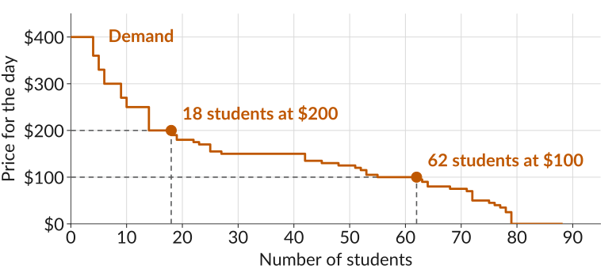
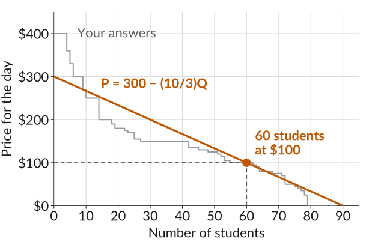
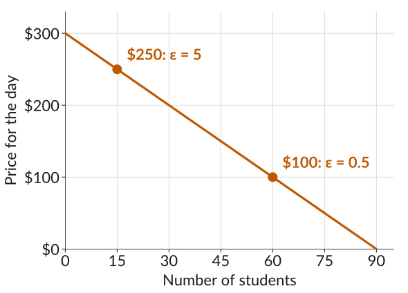
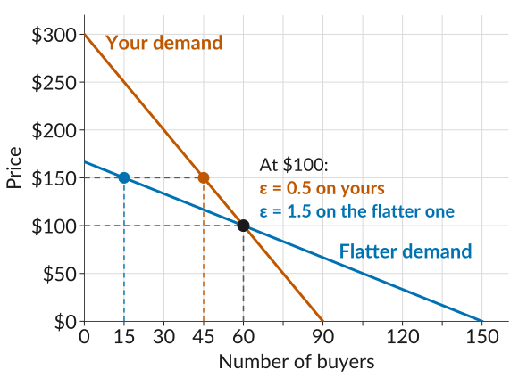

## Last Class: The Cost Side

$$\text{Profit} = \underbrace{P \times Q}_{\text{revenue}} - \underbrace{C(Q)}_{\text{cost}}$$

-   Last class we focused on the cost side, $C(Q)$.
-   Today we focus on revenue, $P \times Q$, which depends on the *demand curve*.
-   Remember the *trade-off*: if firm set's higher price, it will loose some consumers. How many? That depends on the demand curve.

## How Much Would You Pay?

::: plain
In Lecture 3, I asked for the most you would pay for a day at a *Dodgers* game. What you gave me was your *willingness to pay (WTP)*, and we can use it to construct a demand curve.
:::

{.fragment .nostretch height="430" fig-alt="A downward-sloping staircase labelled Demand, price for the day on the vertical axis from 0 to 400 dollars and number of students on the horizontal axis from 0 to 90. Each step is one of the 88 answers, lined up from the highest to the lowest: 4 students would pay 400 dollars, and 9 would pay nothing. Two labelled points: 18 students at 200 dollars and 62 students at 100 dollars."}

## Willingness to Pay

-   *Willingness to pay (WTP)* is an indicator of how much a person values a good, measured by the maximum amount they would pay to acquire a unit of the good.
-   You will go to the game if the price for the day is less than or equal to your WTP.
-   At any price, demand is the number of students whose willingness to pay is at least that price.
-   At \$200, 18 of you have a WTP of \$200 or more, so demand is 18. At \$100, demand is 62.

## The Demand Curve for a Dodgers Game

::: plain
Linearizing your answers gives this demand curve:
:::

$$P = 300 - \frac{10}{3}\,Q \quad\Rightarrow\quad Q = 90 - 0.3\,P$$

{.nostretch height="395" fig-alt="The class's 88 answers drawn as a grey downward-sloping staircase labelled Your answers, price for the day on the vertical axis from 0 to 400 dollars and number of students on the horizontal axis from 0 to 90. A straight orange line labelled P = 300 minus ten thirds Q runs from 300 dollars at zero students to zero dollars at 90 students and follows the staircase closely. One labelled point on the line, with dashed guides to both axes: 60 students at 100 dollars."}

## How Much Does Demand Respond?

-   Sellers setting ticket prices, and economists and policymakers setting policy, often want to know how a change in price will change the quantity people buy.
-   Your demand curve is $Q = 90 - 0.3\,P$. If the price rises by \$10, from \$100 to \$110, demand falls by 3 students.
    -   When $P = 100$, $Q = 90 - 0.3 \times 100 = 60$.
    -   When $P = 110$, $Q = 90 - 0.3 \times 110 = 57$.
-   Often it is more useful to measure the change in percentage terms: if the price rises by 1%, by what percentage does the quantity fall?
-   This standard measure is called the *price elasticity of demand*.

## Price Elasticity of Demand

::: plain
The *price elasticity of demand* is the percentage change in demand that would occur in response to a 1% increase in price:
:::

$$\varepsilon = -\frac{\%\text{ change in demand}}{\%\text{ change in price}}$$

-   Quantity falls when price increases, so the minus sign ensures that we get a positive number.
-   Demand is *elastic* if $\varepsilon$ is greater than 1, and *inelastic* if less than 1.

## Elasticity of Demand for a Dodgers Game

::: plain
When the price rises from \$100 to \$110, demand falls from 60 to 57 students.
:::

$$\begin{aligned}
\%\text{ change in price} &= \frac{110-100}{100} \times 100 = 10\% \\[0.3em]
\%\text{ change in demand} &= \frac{57-60}{60} \times 100 = -5\%
\end{aligned}$$

$$\varepsilon = -\frac{-5}{10} = 0.5$$

-   At \$100, a 1% increase in the price reduces the number of you who would go by 0.5%, so demand is inelastic.

## Worksheet, Activity 1

::: plain
The demand curve is given by $Q = 90 - 0.3\,P$. Find the elasticity of demand for each \$10 price rise below. At which prices is demand elastic?
:::

$$\%\text{ change} = \frac{\text{new} - \text{old}}{\text{old}} \times 100 \qquad\qquad \varepsilon = -\frac{\%\text{ change in } Q}{\%\text{ change in } P}$$

::: gap
:::

::: {.fixedtable .wide}
| $P$ rises from |  $Q$ falls from| % change in $P$ | % change in $Q$ | Elasticity, $\varepsilon$ |
|:-----------------|---------:|---------:|---------:|---------:|
| \$50 to \$60     |          |          |          |          |
| \$100 to \$110   |          |          |          |          |
| \$200 to \$210   |          |          |          |          |

: {tbl-colwidths="[20,18,21,23,18]"}
:::

## Four Ways to Write the Elasticity

::: plain
When price changes by $\Delta P$ and demand by $\Delta Q$:
:::

::: {.fixedtable .wide .formulas}
|     | Using                                        | Elasticity                                                         |
|:----|:---------------------------------------------|:------------------------------------------------------------------:|
| 1   | Percentage changes                           | $\varepsilon = -\dfrac{\%\text{ change in } Q}{\%\text{ change in } P}$ |
| 2   | Proportional changes                         | $\varepsilon = -\dfrac{\Delta Q / Q}{\Delta P / P}$                |
| 3   | The fraction simplified                      | $\varepsilon = -\dfrac{P}{Q} \times \dfrac{\Delta Q}{\Delta P}$    |
| 4   | The slope of the demand curve, $\Delta P / \Delta Q$ | $\varepsilon = -\dfrac{P}{Q} \times \dfrac{1}{\text{slope}}$ |

: {tbl-colwidths="[6,50,44]"}
:::

## Worksheet, Activity 2

::: plain
Use formula 3 to find the elasticity at the same three prices. Do you get the same answers as in Activity 1?
:::

$$Q = 90 {\color{#BF5700}{\,-\,0.3}}\,P \qquad\qquad \varepsilon = -\frac{P}{Q} \times \frac{\Delta Q}{\Delta P}$$

::: plain
Here, $\Delta Q / \Delta P = -0.3$: every \$1 rise in price changes demand by $-0.3$.
:::

::: gap
:::

::: fixedtable
|                                  |        |        |        |
|:---------------------------------|-------:|-------:|-------:|
| Price, $P$                       | \$50   | \$100  | \$200  |
| Demand, $Q$                      | 75     | 60     | 30     |
| Elasticity, $\varepsilon$        |        |        |        |

: {tbl-colwidths="[40,20,20,20]"}
:::

## Elasticity Along the Demand Curve

:::::: columns
:::: {.column width="46%"}
-   As we move down a straight demand curve, the price falls and the quantity rises, so the elasticity falls.
-   At a high price, few people still buy. Losing a few more is a large share of the buyers, so demand is elastic.
-   At a low price, many people buy. Losing the same few is a small share of them, so demand is inelastic.
::::

::: {.column width="54%"}
{fig-alt="The straight orange demand line for a day at a Dodgers game, price for the day on the vertical axis from 0 to 300 dollars and number of students on the horizontal axis from 0 to 90. Three labelled points: at 200 dollars, with 30 students, the elasticity is 2; at 100 dollars, with 60 students, it is 0.5; at 50 dollars, with 75 students, it is 0.2."}
:::
::::::

## Flat and Steep Demand Curves

:::::: columns
:::: {.column width="46%"}
-   Both curves pass through the same point: 60 buyers at \$100.
-   Raise the price to \$150. On your curve, buyers fall to 45. On the flatter curve, they fall to 15.
-   So at \$100, demand is more elastic on the flatter curve: $\varepsilon = 1.5$, against 0.5 on yours.
::::

::: {.column width="54%"}
{fig-alt="Two downward-sloping straight demand lines crossing at one marked point, 60 units at a price of 100 dollars, with price on the vertical axis from 0 to 200 dollars and quantity demanded on the horizontal axis from 0 to 160. The flatter line, labelled Flatter, elasticity 1.5, runs from 160 dollars at 6 units to zero at 150 units. The steeper line, labelled Steeper, elasticity 0.25, runs from above 200 dollars at about 40 units to zero at 75 units."}
:::
::::::

## Why Measure How Buyers Respond?

::: plain
Anyone who sets a price needs to know how buyers will respond to it.
:::

-   A firm wants to know whether a higher price brings in more revenue or less.
-   A city wants to know whether a higher bus fare raises money or empties the buses.
-   A government wants to know how much less people will buy of a good it taxes.

::: plain
But why measure how buyers respond in *percentage changes*?
:::

::: fragment
::: plain
So we can compare goods with very different prices and units, like cars and gasoline.
:::
:::

## Why Percentage Changes?

::: plain
Suppose we want to know who responds more to price changes: people buying cars or people buying gasoline.
:::

-   A car costs tens of thousands of dollars, and gasoline costs a few dollars a gallon. A \$1 price rise is nothing for a car and a big jump for gasoline.
-   Car sales are counted in cars and gasoline in gallons, so "units lost for each \$1 rise" cannot be compared either.
-   Percentage changes remove both problems: a 10% price rise is the same size of change for a car and for a gallon of gas.
-   So we compare the percentage fall in quantity for a 1% rise in price. That is the elasticity.

## Why Elasticity Differs Between Goods

::: plain
Demand is more elastic when buyers can easily switch or buy less:
:::

::: {.fixedtable .wide}
| Reason                      | More elastic          | Less elastic          |
|:----------------------------|:----------------------|:----------------------|
| Close substitutes           | Coffee at Starbucks   | Electricity           |
| Luxury, not necessity       | Concert tickets       | A doctor's visit      |
| Narrowly defined market     | Vanilla ice cream     | Food                  |
| More time to adjust         | Gas over five years   | Gas this week         |
| Big share of spending       | A new car             | Salt                  |

: {tbl-colwidths="[38,31,31]"}
:::

## Elasticity in the Data: Uber

::: plain
Cohen, Hahn, Hall, Levitt, and Metcalfe (2016) used Uber's data. The app rounds the surge multiplier to one decimal.
:::

-   A surge of 1.249 shows as 1.2x, and 1.251 shows as 1.3x. Riders on each side face the same conditions, but pay 8.3% more.
-   At that cutoff, ride requests are about 3% lower. What is the elasticity?

::: fragment
$$\varepsilon = -\frac{-3}{8.3} \approx 0.36$$

::: plain
Across almost 50 million sessions, most of their estimates are between 0.4 and 0.6.
:::
:::

## Elasticity in the Data: A Soda Tax

::: plain
Seiler, Tuchman, and Yao (2021) studied Philadelphia's 2017 tax on sweetened drinks. Prices at city stores rose by 34%.
:::

-   Sales of the taxed drinks at city stores fell by 46%, so demand there was elastic: $\varepsilon = 46 / 34 \approx 1.35$.
-   Many shoppers drove to stores outside the city. Counting those, purchases fell by only 22%, so $\varepsilon = 22 / 34 \approx 0.65$.
-   Stores outside the city are close substitutes, so demand at city stores is the more elastic of the two.
-   Both numbers matter for policy: the city's tax revenue depends on the 1.35, and how much less soda people drink depends on the 0.65.

## Elasticity in the Data: Everyday Foods

::: plain
Average elasticities from 160 US studies (Andreyeva, Long, and Brownell, 2010):
:::

::: fixedtable
| Food or drink                 | Elasticity |
|:------------------------------|-----------:|
| Meals away from home          | 0.81       |
| Soft drinks                   | 0.79       |
| Fruit                         | 0.70       |
| Milk                          | 0.59       |
| Eggs                          | 0.27       |

: {tbl-colwidths="[60,40]"}
:::

::: plain
Every food here is inelastic. Meals out respond most, because cooking at home is a close substitute. Eggs respond least: there is no good substitute at breakfast.
:::

## Quiz 3

-   *Quiz 3 is Monday, September 21*, and covers Lectures 5 to 7.
-   Go through all the slides and work through worksheets and the practice problems before the quiz.

## Sources {.smaller}

-   Cohen, Hahn, Hall, Levitt, and Metcalfe (2016), "Using Big Data to Estimate Consumer Surplus: The Case of Uber," NBER Working Paper 22627.
-   Seiler, Tuchman, and Yao (2021), "The Impact of Soda Taxes: Pass-Through, Tax Avoidance, and Nutritional Effects," Journal of Marketing Research 58(1).
-   Andreyeva, Long, and Brownell (2010), "The Impact of Food Prices on Consumption: A Systematic Review of Research on the Price Elasticity of Demand for Food," American Journal of Public Health 100(2).
