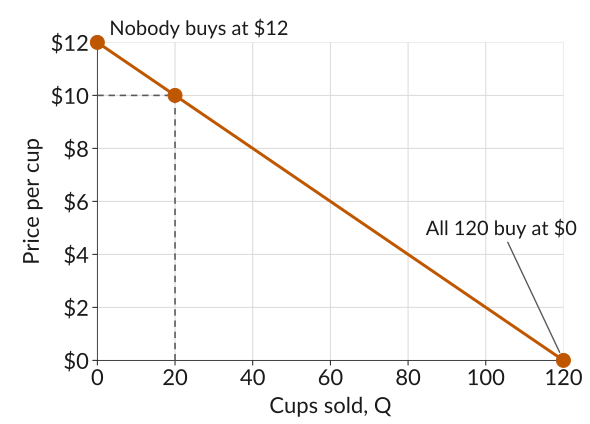
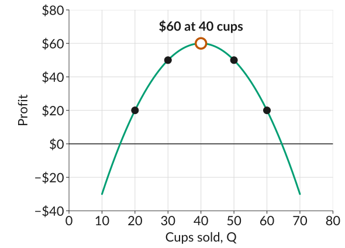
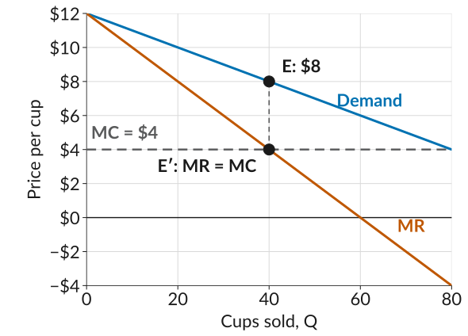

## Boba Break

::: plain
Boba Break is a stall at the Tuesday farmers market on campus. What price should it charge for a cup of boba to maximize its profit?
:::

$$\text{Profit} = \underbrace{P \times Q}_{\text{revenue, } R} - \underbrace{C(Q)}_{\text{cost}}$$

-   In choosing the price, they need to consider their costs, given by the *cost function* $C(Q)$.
-   Boba Break also faces the tradeoff: a higher price $P$ means more revenue per cup, but it will sell fewer cups $Q$ (*demand curve*).

## Boba Break's Costs

:::::: columns
:::: {.column width="50%"}
Boba Break pays \$100 for the stall per day and it costs \$4 to make each cup of boba. So the total cost is $$C(Q) = 100 + 4Q$$
  
-   Remember that the *average cost* is the cost per unit, $\text{AC} = C(Q)/Q$
-   The *marginal cost* is the increase in total cost for every additional unit, $\text{MC} = \Delta C / \Delta Q$
::::

::: {.column width="50%"}
::: {.fixedtable .wide}
| $Q$ | $C(Q)$ | $\text{AC}$ | $\text{MC}$ |
|:---:|:------:|:-----------:|:-----------:|
| 20  | 180    | 9.00        | 4           |
| 30  | 220    | 7.33        | 4           |
| 40  | 260    | 6.50        | 4           |
| 50  | 300    | 6.00        | 4           |
| 60  | 340    | 5.67        | 4           |

: {tbl-colwidths="[25,25,25,25]"}
:::
:::
::::::

## Boba Break's Demand Curve

:::::: columns
:::: {.column width="45%"}
-   About 120 students walk past the stall.
-   Their willingness to pay is spread evenly from \$0 to \$12, so every \$1 off the price sells 10 more cups.
-   So the demand curve is:

$$P = 12 - \frac{Q}{10}$$
::::

::: {.column width="55%"}
{fig-alt="A straight downward-sloping line, price per cup on the vertical axis from 0 to 12 dollars and cups sold on the horizontal axis from 0 to 120. Nobody buys at 12 dollars, and all 120 students buy at 0 dollars. Dotted lines from both axes meet at the point 20 cups and 10 dollars."}
:::
::::::

## Revenue, Cost, and Profit at 20 Cups

::: plain
How do we get Boba Break's profit for any quantity $Q$?
:::

-   To sell $Q = 20$ cups, the demand curve says the price has to be $P = 12 - Q/10 = 12 - 20/10 = 10$.
-   Revenue is $R = P \times Q = 10 \times 20 = 200$.
-   Cost is $C(Q) = 100 + 4Q = 100 + 4 \times 20 = 180$.
-   Profit is $R - C(Q) = 200 - 180 = 20$ for the day.

## Revenue, Costs, and Profit

::: plain
Doing the same for several quantities gives the table below.
:::

::: {.fixedtable .wide}
| $Q$ | $P$ | $R$ | $C(Q)$ | Profit |
|:---:|:---:|:---:|:------:|:------:|
| 20  | 10  | 200 | 180    | 20     |
| 30  | 9   | 270 | 220    | 50     |
| 40  | 8   | 320 | 260    | 60     |
| 50  | 7   | 350 | 300    | 50     |
| 60  | 6   | 360 | 340    | 20     |

: {tbl-colwidths="[20,20,20,20,20]"}
:::

## Profit at Each Quantity

:::::: columns
:::: {.column width="46%"}
-   Profit rises to 40 cups and falls after it.
-   At 40 cups the price is \$8 and profit is \$60 for the day.
-   Selling more cups means cutting the price on *every* cup, and past 40 that costs more than it brings in.
::::

::: {.column width="54%"}
{fig-alt="A hill-shaped curve, profit on the vertical axis from minus 40 to 80 dollars and cups sold on the horizontal axis from 0 to 80. Five points are marked: 20 dollars at 20 cups, 50 at 30, a labelled peak of 60 dollars at 40 cups, 50 at 50, and 20 at 60."}
:::
::::::

## Marginal Revenue

::: plain
The *marginal revenue* is the increase in revenue when one additional unit of output is sold:
:::

$$\text{MR} = \frac{\Delta R}{\Delta Q}$$

::: plain
*Example*: Boba Break goes from 20 cups to 21.
:::

-   To sell 20 cups, the price has to be \$10, so revenue is $10 \times 20 = 200$.
-   For 21 cups it has to be \$9.90, so revenue is $9.90 \times 21 = 207.90$.
-   Revenue goes from \$200 to \$207.90, so $\text{MR} = 207.90 - 200 = 7.90$.
-   Marginal cost is constant here: going from 20 cups to 21, cost rises by \$4.

## Marginal Revenue at Several Quantities

::: plain
Here is the marginal revenue from one more cup at each quantity. Where is it above the marginal cost of \$4, and where is it below?
:::

::: {.fixedtable .wide}
| $Q$ | $R(Q)$ | $P(Q+1)$ | $R(Q+1)$ | $\text{MR}$ | $\text{MC}$ |
|:---:|:------:|:--------:|:--------:|:-----------:|:-----------:|
| 20  | 200    | 9.90     | 207.90   | 7.90        | 4           |
| 30  | 270    | 8.90     | 275.90   | 5.90        | 4           |
| 40  | 320    | 7.90     | 323.90   | 3.90        | 4           |
| 50  | 350    | 6.90     | 351.90   | 1.90        | 4           |

: {tbl-colwidths="[14,18,18,18,16,16]"}
:::

::: plain
*Note*: marginal revenue is always less than the price. To sell one more cup, Boba Break has to lower the price on every cup it was already selling: at 20 cups the 21st cup sells for \$9.90, but revenue rises by only \$7.90.
:::

## Marginal Revenue Meets Marginal Cost

:::::: columns
:::: {.column width="46%"}
-   Marginal revenue at every quantity gives the *marginal revenue curve*. It lies below the demand curve, because MR is less than the price.
-   Marginal cost is flat at \$4.
-   The two cross at 40 cups, at $E'$. Going up to the demand curve at $E$ gives the price, \$8.
::::

::: {.column width="54%"}
{fig-alt="Three lines, price per cup on the vertical axis from minus 4 to 12 dollars and cups sold on the horizontal axis from 0 to 80. The demand curve slopes down from 12 dollars, the marginal revenue line slopes down twice as steeply from the same point and crosses zero at 60 cups, and marginal cost is flat at 4 dollars. Marginal revenue crosses marginal cost at 40 cups, marked E prime, directly below the point E on the demand curve at 8 dollars."}
:::
::::::

## The Rule for Choosing Quantity

-   While marginal revenue is above marginal cost, selling one more cup adds to profit.
-   Once marginal revenue falls below marginal cost, the extra cup costs more than it earns.
-   The 40th cup adds \$4.10 to revenue and the 41st only \$3.90, against a cost of \$4 each.
-   The *profit-maximizing quantity* is where the two are equal, $\text{MR} = \text{MC}$: for Boba Break, 40 cups, sold at \$8 a cup.

## Does the Stall Fee Change the Best Quantity?

-   At each step, Boba Break asks: should it sell one more cup? The answer depends only on what that cup adds to revenue ($\text{MR}$) and to cost ($\text{MC}$).
-   The \$100 stall fee is the same whether Boba Break sells 39 cups or 41, so it never enters that comparison.
-   Check: raise the fee to \$150, and profit at 20, 30, 40, 50, and 60 cups goes from 20, 50, 60, 50, 20 to −30, 0, 10, 0, −30. It still peaks at 40 cups.
-   Boba Break makes the same choice of price and quantity, but earns \$50 less.
-   The fee does matter for a different decision: whether to set up the stall at all. At 40 cups, revenue minus the cost of the cups is \$320 − \$160 = \$160, so the stall is worth it while the fee is below \$160.

## What to Do Next

-   Before next class: read section *7.6*, and go over the *slides* and the *worksheet*.
-   Section 7.6 also finds the best price and quantity using *isoprofit curves*. We skip those and use marginal revenue and marginal cost, as we did today.
-   Work through the *practice problems* for this lecture.
-   Next class we ask who gains from the sale, the buyer or the seller, and by how much.
-   *Quiz 4 is Monday, September 28*, and covers Lectures 8 and 9.
